# Ousa apps for the Car Thing

Six apps for the [Spotify Car Thing](https://bridgething.com), published from one source. Add the
source once and all of them are available.


| App | What it does |
| --- | --- |
| **O-Music Player** | Now playing, in seven styles, coloured by the album art, on a screen that turns |
| **O-Clock** | A clock in ten faces, eight timers, a stopwatch and an alarm |
| **O-Network Monitor** | Link status, latency and measured throughput |
| **O-Quote Flow** | A quote of the moment, with favourites and your own lines |
| **O-Desk Exchange** | A fictional stock market: invented tickers, headlines and prices |
| **O-Gold Tracker** | Live gold spot, Khmer weight conversion and a private purchase ledger |
| **O-Map** | Cambodia on the dash, with live traffic when you bring a key |
| **O-Photos** | An Immich library on the dash, as a photo frame |

## Put it on your Car Thing

Your device needs [bridgething](https://bridgething.com) installed, with its companion app paired
to your phone. Then:

1. Open the **companion app** on your phone.
2. Go to the app store section and **add a source**.
3. Paste this url:

   ```
   https://ousachea.github.io/Ousa-Music-Player-v1/catalog.v1.json
   ```

4. The apps appear in the list. Install the ones you want.
5. Open them from the device's launcher.

Updates show up in the same place. Music Player can also tell you when it is behind: open its
settings on the device and press **Check** under *Software update*.

> Music Player and Network Monitor each ask for `net.proxy`. Music Player uses it to fetch a sharper
> copy of the album art than the device receives on its own, to fill in the artist on tracks the
> phone sends none for, and to mark the ones that are explicit, all of which you can turn off in its
> settings;
> Network Monitor uses it to time the requests it measures with.

## O-Music Player

Music notes drift up over whichever style you pick, each one tinted a little differently from the
album art. They pause with the music, and **Display → Floating notes** turns them off.

### The seven player styles

Switch between them in the settings, under **Player style**. A small tag along the bottom of the
screen names the one you are in.

When the track changes the blurred background dissolves from one cover to the next rather than
cutting between them. Vinyl and CD mark the change by swapping the record or the disc, which turns
in from a little smaller and settles; Cover, Cassette and Poster slide the new track in from the side it came
from, which is the side you swiped.

### Vinyl

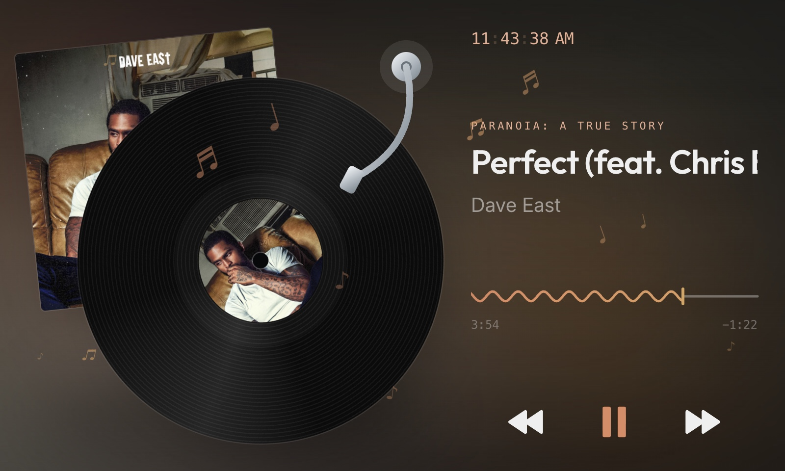

A new track brings a new record: the turntable drops in and settles, and the disc does the same in
the CD style. The platter turns while the track plays and holds its angle when you pause; the
tonearm rests on the outer grooves and lifts off when the music stops.

**Layout** gives the style two arrangements, and the paper label in the middle of the record is the
switch between them: a tap pulls the record out of its sleeve, another puts it back on the platter.
**Turntable** is the record on the platter with the sleeve tucked behind it, and touching the sleeve
trades their places, the sleeve coming forward and growing while the record drops behind it, which
is also **In front** in the settings. **Sleeve** is the copy someone has just pulled: the cover
square and flat on one side, the record half out of it on the other with its paper label showing in
the album's colour.

**Record colour** presses the disc in something other than black. Album gives it the cover's own
colour and Marble swirls the cover's two colours through it, both dark enough that the grooves and
the sheen still read, since a coloured pressing is what the resin is rather than a light shone on
it. The colour is set in the settings; the label under your finger is the layout switch.

### CD

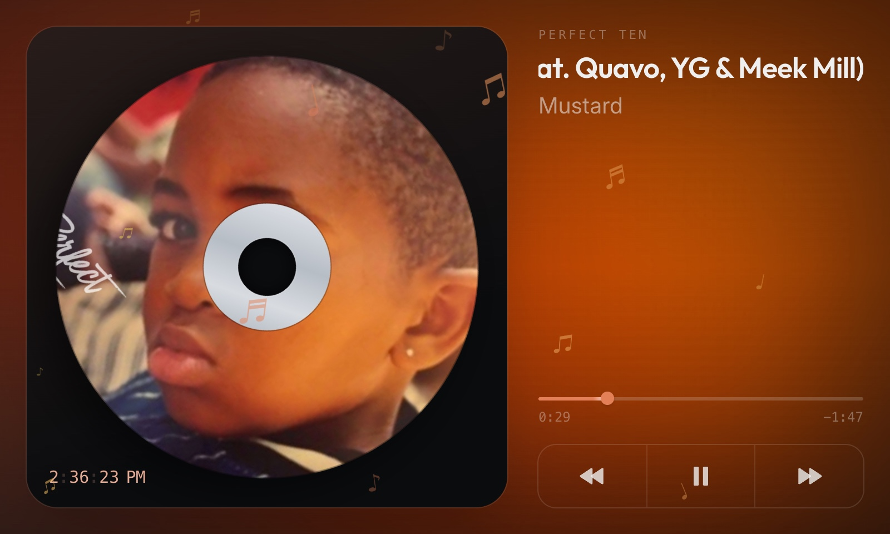

The album printed across a disc, with the clamping ring and the hole punched through the middle of
it and a sheen sweeping over the print. The disc sits centred in a tray washed with a dark version
of the album's own colour, and it turns while the track plays, holding its angle when you pause.

The track sits beside the disc rather than over it, so nothing has to be read against the artwork.
The transport here is one outlined block split into three, with the progress bar directly above it.
Landscape sets the tray on the left and runs the track, bar and buttons down the right; turned, the
whole thing stacks the way a phone would.

### Cassette

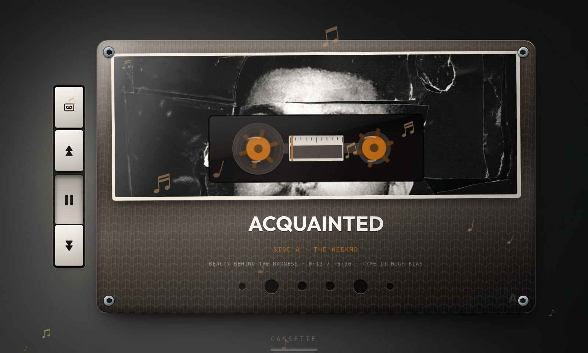

A tape sitting in a deck, in three designs. **Written** is a blank label somebody filled in: the title
across the cream card, the rainbow band every tape wore under it, and a window below that showing
the two spools. **Printed** is a pressed release: the cover itself is the label, printed as a
sticker with a paper edge and pressed on a hair crooked, with the window die-cut through it, and the
track is stamped on the moulded half below in bold caps, with SIDE A and the artist under it, the
album and the time under that, and the spindle holes along the very bottom. Its shell is brushed
metal rather than plastic: a fine grain across it, the sheen rolled metal carries in bands, a bright
machined edge and a narrow specular streak, anodised in the cover's hue so faintly that the light
does most of the work. It is bolted together with socket caps rather than the slotted screws holding
the written shell shut.

**Clear** is the tape itself, lying the way the other two do but seen through its own shell: two
spools of brown tape filling the face, hubs in the album's colour with the crown of teeth a spindle
grips, the guide assembly and its pressure pad showing through the plastic along the bottom, the
cover behind the square window between the spools, COMPACT CASSETTE moulded into it, and a white
label strip across the top carrying the track, TAPE TYPE: HIGH BIAS / CHROME, the artist, STEREO and
the time.

A new track is a new tape, not the same one relabelled: one of eight patterns is picked from the
track itself, so the same song always comes back on the same tape while the next one arrives on
another. On the written label it prints faintly under the writing and around the window; on the
printed shell it is machined into the metal.

The transport is a tape deck's: light plastic caps with black glyphs, bevelled at the top and shaded
at the bottom, sunk in a dark strip that they press into. The play key latches: while the track is
playing it stays down, its shading inverted the way a depressed key catches the light, and it comes
back up when you pause. In landscape the keys stand in a column down the left of the tape, with
previous and next turned a quarter to point along it; turned a quarter themselves they go back to a
row underneath. A fourth key sits with them and switches between the designs, and **Tape design**
does the same from the settings.

The spools are the progress bar in both: the left one starts full and empties as the song plays
while the right one fills, and both turn while the music runs and hold where they are when you
pause. On the printed tape the counter marks the same thing again, a line riding the ticks. The
written label reads PLAY or PAUSE and STEREO along the top, the artist under the ruled line, and the
album with the elapsed and remaining times along the bottom edge; the printed one puts the time in
the credits under the window.

The whole tape is painted from the cover, so a new track repaints the plastic. The shell, the label,
the plate around the window, the tape wound on the spools, the writing and the keys are all mixed
from the album's own hue rather than from a cream that has been tinted, and the rainbow band fans out
around that hue, two bands to each side of it, rather than five bands of the one colour.

**Artwork on the label** prints the cover on the right of the written label, faded into the paper
along its inside edge, with the writing keeping the room to its left. Turn it off for a label with
nothing but handwriting on it. On the printed design the cover is the label itself, so nothing there
depends on this.

Turned a quarter the printed title takes a third line rather than a smaller shell, and the clear
tape finally gets the shape it wants.

It is moulded rather than drawn flat: light rakes across the shell in one diagonal, the screws are
turned and slotted, the window is sunk into the label with a shadow down its inside, and the tape on
a spool is ringed with the turns of its wind under a cream hub with a highlight riding round it. A
fine line texture sits over the label the way it does over printed card, and the label is marked
SIDE A and TYPE II like the tape it is copying.

Three small keys sit in a sunken deck bar under the tape and go down and dark when you touch them. With the on-screen buttons off
the tape takes the whole screen instead. Turned a quarter the tape is sized by the width it has
rather than the height, so it keeps its shape rather than stretching into the taller box.

### Dial

A jog wheel beside a card, on a wash of the album's own colour. The track runs round the outside of
a black disc as a thick arc from twelve o'clock, in that colour, with a machined ring of ticks
inside it, the grooves faint under that, and the cover turning slowly in the middle as the record's
label. Ten seconds back and ten forward sit either side of it, with the elapsed time and the length
underneath.

The card is the same colour taken down dark enough to read white type on, and stands off the screen:
light along its top edge, a soft shadow under it, and the panel of words cut into it as a well,
darker again with a shadow along its top lip and a catch of light along the bottom one. The words roll through that well, the line being sung
in the middle and larger, the ones either side fading out at the edges, and the column slides rather
than stepping when the line changes. A long line is set smaller instead of being cut. With no words
it shows the album, title and artist instead. Under it the track reads again with the cover as a small round badge, and
under that previous, play and pause as a white circle, and next.

### Poster

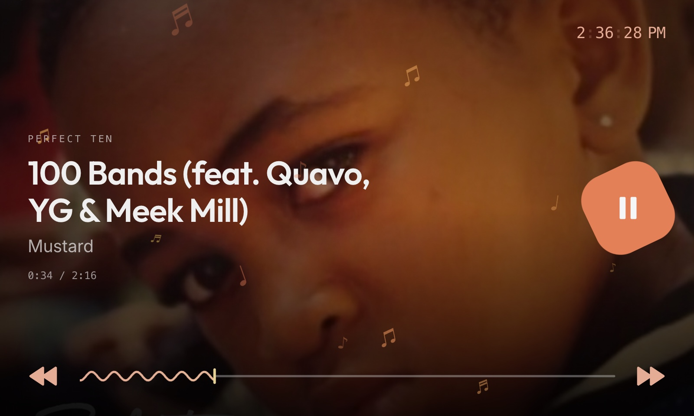

The artwork fills the whole screen with the track laid over it, and a long title wraps onto as many
rows as it needs rather than scrolling past. The play button's rounded square turns slowly while the
track plays and holds where it is when you pause, with the glyph staying upright on top of it. The progress line is drawn as a wave
for the part you have played and a flat line for the rest, and the wave travels while the music runs.
This is the style that benefits most from the sharper artwork lookup.

### Cover


The album art beside the track, after a phone lock screen: the artwork, the track, a progress bar
with the elapsed and remaining times, the transport, and a volume slider of its own. Dragging that
slider sets the volume on the device, and unmutes it first if it was muted. It also moves when you
turn the wheel, so this style leaves out the volume readout the others throw over the middle of the
screen. The output picker a
phone puts beside the transport is not here, because a Car Thing has nowhere else to send audio.

Landscape sets the artwork at full height on the left. To the right the clock, the track and the
progress bar space themselves down the same height, and the transport and volume slider hold the
bottom edge. Nothing is layered over anything: the blurred artwork runs the whole screen, so the
album's colour carries under the controls instead of stopping at an edge. Turned to 90 or 270 the
same rows stack into a column and fill the screen, with the times either side of the bar because the
column is too tall to put them under it.

**Panel behind the track** puts the track and the controls on a tinted panel of their own rather
than straight over the artwork, and **Volume slider** takes the slider away, in which case the wheel
still works and the reading the other styles show over the middle of the screen comes back.

**Art to the edge** drops the padding around the art, along with its rounded corners, ring and
shadow, so it runs flush to the edges of the screen. The track and the controls keep an even margin
of their own, the same on every side, rather than losing it with the art. **Art pulse** beats a glow
around it, at a tempo you set.

### Lyrics

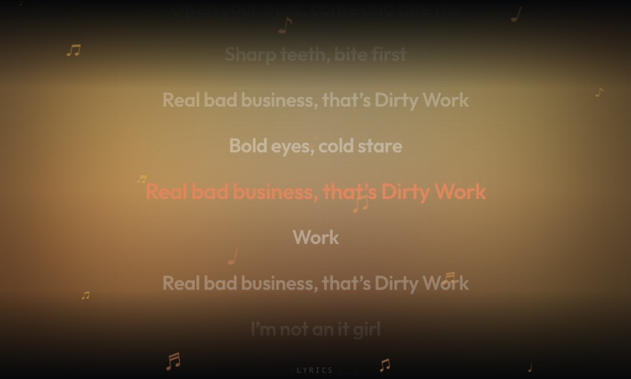

The words, with the line being sung held on the middle of the screen and filling with the album's
colour as it is sung: a second copy of the line, clipped to how far into it the song is, sweeps
across the one underneath. The phone's timings say when the line starts and when the next one does,
and the fill runs the whole way between them in one move, so it reaches the end of the line as the
next one takes over rather than stepping along a quarter second at a time.

Nothing on this screen is outlined. The words, the track and the time are all drawn plain over the
artwork and hold their contrast by weight and brightness alone.
The rest step back from it in three grades: the lines either side are set at about four fifths and
softer, the pair beyond them at two thirds and fainter again, and everything past that smaller and
faint. The line being sung is plainly the largest thing on the screen. The words also
thin to nothing at the top and bottom so a line leaves rather than stopping at an edge.

No line is ever cut short. A long one is set smaller instead, in four steps down, so it reads whole
rather than ending in an ellipsis. Nothing is darkened to do it: the words themselves are
masked, and the artwork behind them keeps its full strength. The column is what moves, not the
lines.

How far through the song is runs along the top edge of the screen: a hairline the width of the
display that fills as the track plays, and dims while it is paused. Nothing is drawn for it to sit
in, which is the point. The elapsed time against the length reads in the middle of that edge, under
the line that draws it, level with the track in the corner; the button that puts the words away sits
on that same line at the other end, and stays there whether the words are showing or not, so the top
of the screen reads as one row.

With the on-screen buttons off, the preset bumps share that edge. They are drawn over the progress
line rather than under it, and in plain white rather than the album's colour, so the hardware marker
and the progress do not read as the same thing.

The transport is one row along the bottom: previous and next at the ends of it and play and pause in
the middle, where a thumb lands, all three bare glyphs in the album's colour with nothing drawn
behind them. All of it goes away when the on-screen buttons do, and the line along the top does
not.

The artwork and the track sit in whichever corner you pick, under **Track corner**. On the right the
artwork leads and the track reads back towards it, and a corner along the bottom sits above the
transport rather than under it. A long title takes two lines there rather than being cut off. The button that puts the words away takes the top corner opposite
the track.

Touching a line plays from it: each line knows the moment it belongs to, so the words are also the
scrubber. The wheel reads rather than scrubs, moving the words a line a click while the song carries
on, and the view returns to the line being sung a few seconds after you stop.

The button in the top corner puts the words away and brings them back, and **Show the words** does
the same from the settings. Plus and minus down the left edge set how large the words are, from 70%
to 160% in tens; the rows grow with the type, so nothing runs into anything. **Text size** in the
settings sets the same thing by number. The lines stop short of the edges of the screen, so the
strip those keys sit in belongs to them and a tap that lands beside one does not seek the song. With them off, or on a track that has none, the style shows the artwork, title
and artist down the middle instead, with the transport under them.

What you get depends on what the phone has. Timed lyrics get the moving column. Lyrics without
timings are laid out as a page, which the wheel scrolls. A track with neither says so under its
title rather than leaving the screen blank.

### The queue

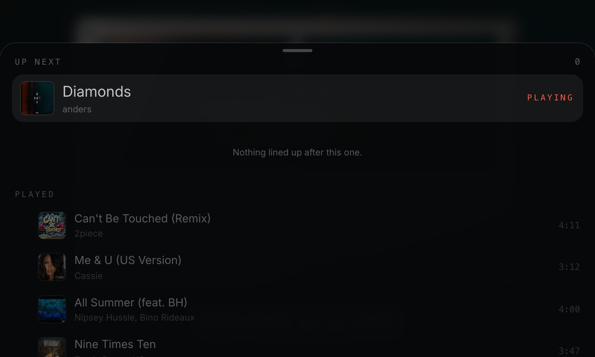

Pull up from the bottom edge of the screen and the phone's queue comes with it: what is playing at
the top, everything lined up after it, and what has just been played under that, each row with its
own artwork and length. Touching a row in the queue skips to it. The wheel scrolls the list, and a
push back down or the Back button puts it away. A short bar at the bottom of the screen says the
edge is worth pulling on.

It is the phone's queue, so the player only reads it: skipping to a row is the one thing the daemon
lets a webapp do to a queue it does not own. What has already been played reads back rather than
acting as buttons, because a phone will not play one of its own history uris on a webapp's say-so.
A phone playing from a radio or an autoplay context often reports nothing lined up, and the sheet
says so rather than showing an empty list.

The pull works off whichever edge is the bottom for you. Every swipe is turned back through the
screen rotation before it is measured, so a quarter turn moves the gesture with the picture.

### Controls

| What you do | What happens |
| --- | --- |
| Preset button 1 | Previous track |
| Preset button 2 | Play or pause |
| Preset button 3 | Next track |
| Preset button 4 | Turn the screen a quarter: 0, 90, 180, 270 |
| Mode, the button past the presets | Cycle the player style: Cover, Vinyl, CD, Cassette, Dial, Poster, Lyrics |
| `5` on a keyboard | The same, for working against the dev server |
| Turn the wheel | Volume, or scrub the track — your choice in settings |
| Press the wheel once | Play or pause |
| Press it twice | Next track |
| Press it three times | Previous track |
| Button under the wheel | Opens and closes settings |
| Tap the play button | Play or pause |
| Drag the progress bar | Seek |
| Swipe across the screen | Next track, or previous if you swipe the other way |
| Swipe up from the bottom edge | Open the queue |
| Swipe it back down, or Back | Close the queue |

A press waits a moment to see whether another one follows, so play/pause from the wheel is very
slightly delayed. The on-screen button is instant.

### Screen orientation

Preset 4 turns the screen a quarter at a time, 0 to 90 to 180 to 270 and round again, for a device
that is not sitting the way it was designed to. It is also a setting, under **Display → Screen
rotation**, and whichever way you set it the choice is remembered.

The screen itself never changes shape. A quarter turn hands the player a 480 by 800 box rather than
800 by 480, and each style lays itself out for that rather than being squashed into it: the artwork
goes above the track instead of beside it, Cover puts the elapsed and remaining times either side of
the progress bar because the column is too tall to stack them under it, and the record and the disc
are sized by height so they stay round.

What is fixed to the hardware turns back. The preset markers move to whichever screen edge the
buttons are actually on, and their glyphs stay square to the device rather than lying over with the
layout, because they describe buttons rather than content. A swipe is read along the axis you
actually swiped, and dragging the progress bar reads along the axis the bar lies on for you, not the
one it lies on in the layout.

### Settings

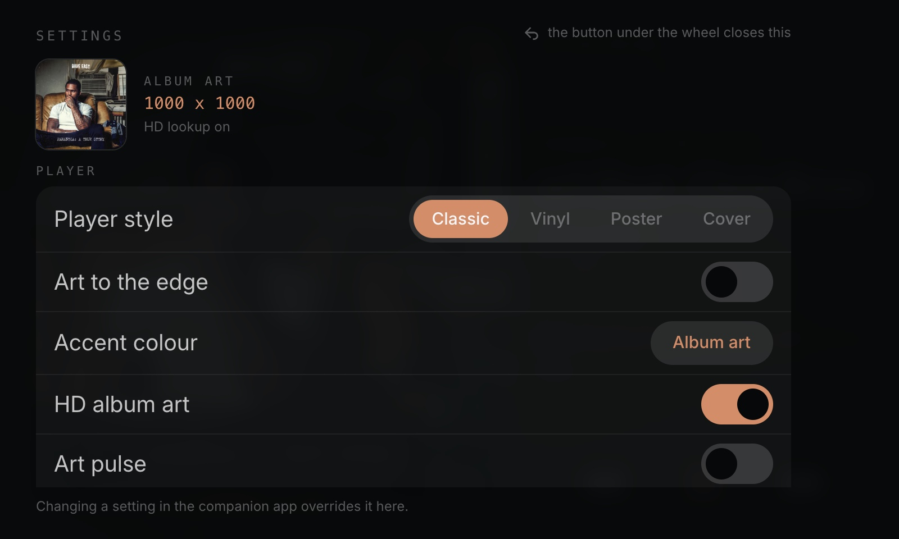

Press the button under the wheel to open them on the device. The style picker sits at the top,
outside the list, because it decides what the rest of the list holds, and everything that only
applies to the style you are in is gathered under that style's name. Poster has no such group: it
has no settings of its own. A rail down the left edge shows where you are in the list.

- **Player** — style, accent colour, HD album art, the art pulse with its tempo, whether Cover's art
  runs to the edge of the screen, the colour the Vinyl record is pressed in, and which cassette
  design is on, with or without the cover on its label
- **Controls** — what the wheel does, how far each click seeks, the seek bar and its playhead dot,
  and whether the on-screen transport buttons are drawn at all
- **Backdrop** — how strongly the blurred art tints the screen, how far out of focus it is, and how
  far it drifts
- **Display** — animations, floating notes, screen rotation, and whether the time counts down or
  shows the track length
- **Clock** — position, size, 12 or 24 hour, and seconds
- **About** — check whether a newer version has been published

Both seek settings sit on **Auto**, which gives Poster the wave and Vinyl a line, and draws the
playhead dot everywhere except Cover. Cover always draws a line whatever you pick.

A few seconds into a track the player offers to hide the on-screen buttons, since the presets do the
same job. The note has a box to stop it asking again, and **Controls → Offer to hide them** turns it
back on if you change your mind.

**With the on-screen buttons off**, Poster hands the track the full width of the screen, since the
half it usually keeps is only there to clear the play button. A bump appears against the edge at
each of the four presets' own positions, with the glyph for what that button does beside it. The bumps follow the screen rotation
so they stay on the physical buttons, and the glyphs stay square to the device rather than lying
over with the layout, because they describe hardware. Each glyph shows itself on every new track and
then fades, leaving the bumps. The room the buttons give up goes to the track, whose title and
artist wrap onto as many rows as they need instead of scrolling past on one line.

Everything is also editable from the companion app, which has room for longer explanations. Whichever
one you changed last wins.

## O-Clock

A clock, and the three things that usually sit beside one.

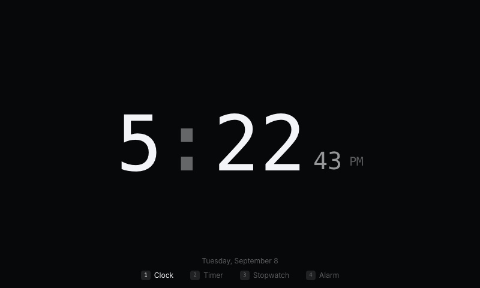

**Ten faces.** Digital, Digital + Date, Minimal, Border, Flip, Analogue, Calendar, World, Binary and
Word. Calendar is the month the phone thinks it is, laid out from Monday with today lit in the
colour you picked; the days either side of the month are drawn faint rather than left out, so the
grid keeps its shape whatever month it is.
Border makes the screen's own edge the second hand: a line round all four sides, square into the
corners, filling from the top clockwise, one lap a minute, so the time inside it needs no seconds of
its own. With
the seconds turned off it takes the minute of the hour instead, and moves once a second rather than
sixty times. Flip is a real split-flap: the top leaf falls away to uncover the digit behind it, then the new bottom leaf
swings up over the old one. World reads three cities beside the local time, picked from eighteen,
and says when one of them is already on tomorrow. Binary is four rows of 8-4-2-1, one column per
digit, with the decimal under each. Word spells it out, on a twelve hour dial, because "seventeen
forty-five" is not how anyone says it.

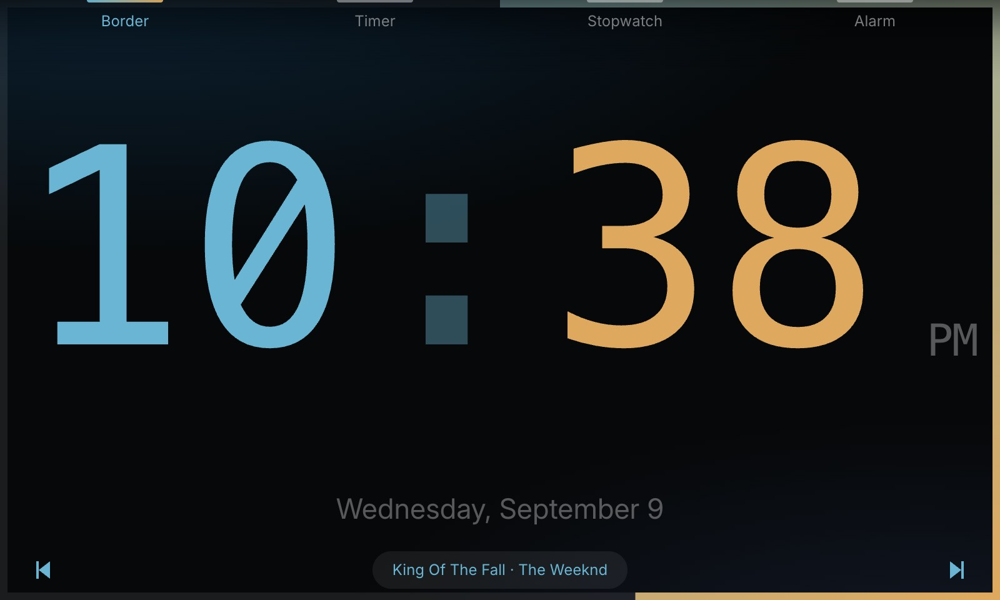

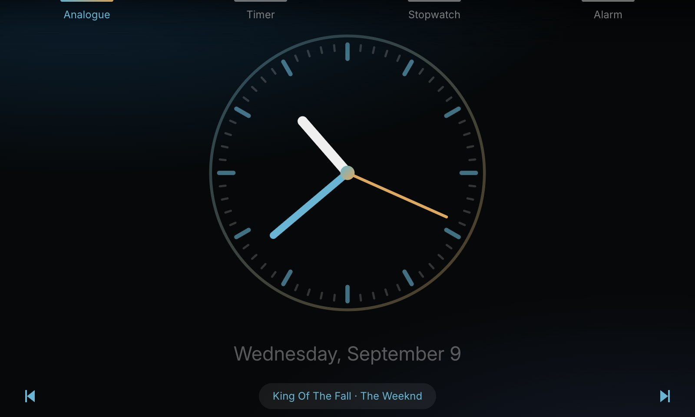

**Eight timers.** Countdown is the plain one; Circular puts a ring around it that empties as the
time does; Bezel is a watch's timer, a card whose own border is the countdown, emptying clockwise
from the top, with pause on one end, a red cross on the other, the time it comes due above the
figures and the word Timer under them; Pomodoro runs work and break and moves itself between them;
Interval runs work and rest for a number of rounds; Kitchen is a real dial, one turn an hour, whole
minutes; Preset is 1, 5, 10 and 30 minutes and picking one starts it; Multi runs up to four at
once. A phase ending inside a
pomodoro or an interval chimes once and carries on rather than taking the screen, since a countdown
you have to dismiss is no use halfway through a set.

The presets are the four screens, and each one has a bump along the top edge of the glass directly
under the button that works it. The bump names its screen when you arrive and then fades, leaving
the mark; the one you are on stays lit.

**1** is the clock, and pressing it again once the clock is up walks the faces, so one button is the
whole thing — the bump names the face, so it explains itself. The wheel walks them too. **2** is the
timer, whichever of the seven you have it set to; the wheel dials it. **3** is a stopwatch running
to hundredths, with laps. **4** is an alarm: set the hour with the buttons and the minutes with the
wheel, switch it on, and it rings at that time. The alarm outlives a restart. **Mode** moves between
the four screens.

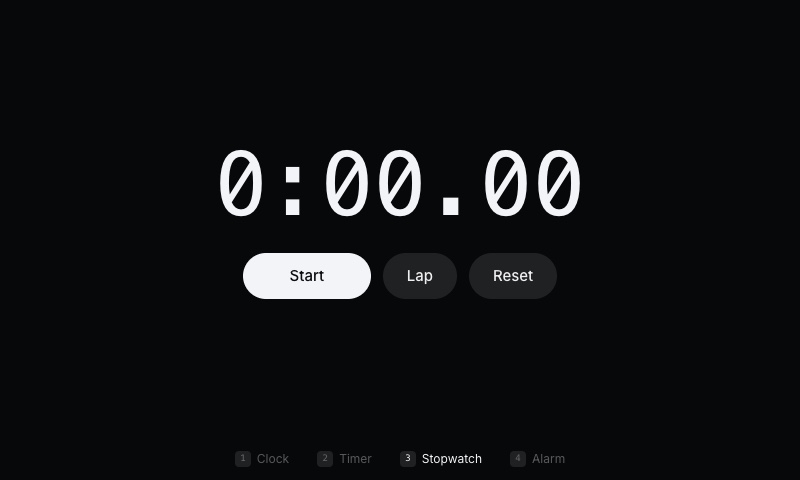

The wheel button opens the settings for whichever screen you are on, and the presets move between
those the same way they move between the screens, so the panel is always about the thing in front of
you. Clock has the face, its cities, the hour format, the seconds and the date. Timer has the style
and whatever that style runs on — pomodoro's work and break, interval's work, rest and rounds, how
long it rings, what one click of the wheel is worth. Stopwatch has hundredths and whether to keep
laps. Alarm has how long it rings, and the hour format it reads its own time back in. Each of the
two that ring has its own sound setting.

**Flashing colon** blinks the colon once a second, lit for the first half of each one, the way a
clock says it is running. It is on by default and off in one tap, for a face you would rather held
still. Digital, Digital + Date, Minimal and Border draw a colon; Flip, Analogue, Binary and Word
have none to blink.

**Face size** scales whichever face you are on: Small, Medium, Large, or Fill, which measures the
face and takes the largest scale the screen has room for. The date is scaled with it, rather than
staying small under a clock that has grown to the screen, and sits under the face as part of the
same block rather than pinned to the bottom of the screen, so the clock and its date read together
whatever else is on the screen.

**Screen rotation** turns the whole app a quarter at a time, 0 to 90 to 180 to 270, for a device
mounted on its side. The four preset bumps follow the buttons round to whichever edge they are
physically on, so they still point at the hardware that works them.

**What is playing** sits along the bottom of every screen while there is a track, unless you turn it
off: previous at one edge and next at the other, and the track itself between them. The title is the play button rather
than a button beside one, lit in the clock's colour and held on a soft pill while the music runs,
grey and flat while it does not. It all works the phone's player, so a track can be changed without
leaving the clock. The strip appears only when something is on, and every screen keeps clear of the
room it takes, the clock making its own room so Border can still draw on the screen's edge. **What
is playing** in the settings takes the strip away for a screen that is only ever a clock; the colour
carries on following the album art if you have asked it to.

**Follow the album art** hands the colour to whatever is playing: the daemon says which track is on,
the cover comes back as bytes, and the two strongest hues in it become the pair the clock is drawn
from, changing with the track. A cover with no usable hue in it, a black and white one say, leaves
the colour you picked alone rather than washing the clock grey, and so does having nothing playing.

Colour is a pair rather than a single tint. The hour takes the first and the minute the second, the
countdowns and the stopwatch run a gradient across the numerals, the dials and their hands are drawn
from the same two, and the screen behind carries a soft wash of them, so the empty half of a clock
face has a temperature. Eight to pick from — White, Amber, Cyan, Green, Pink, Sunset, Aurora and
Ember — as swatches under every settings panel, or by name in the companion app.

When something rings it takes the screen and repeats a tone until you touch it or press anything,
and gives up after however long that screen says. A countdown under ten seconds leaves your colour
for one that reads as running out, and takes the wash with it.

The time itself comes from the daemon, which carries the phone's wall clock, timezone and locale.
The kiosk's own clock is not set from anything, so the face says it is waiting rather than showing a
time it cannot stand behind.

## O-Network Monitor

A second app in this source: a live view of the device's connection.

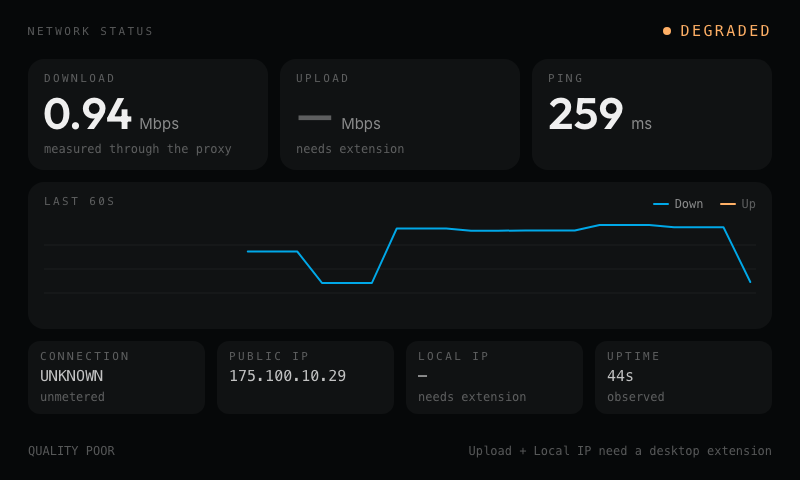

It shows link status (connected, degraded, offline), round trip latency, measured download
throughput, the connection kind and whether it is metered, your public address, and how long the
link has been up as this app has observed it. The graph keeps the last 60 seconds.

**What is measured, and what is not.** The daemon proxies HTTP and reports the link kind, but it
exposes no interface counters. So latency and download are measured by timing real transfers, which
means download is what the app can pull *through the proxy* rather than the line's ceiling, and
throughput sampling pauses itself on a metered link. Upload and the local address are reported as
unavailable rather than estimated.

**To make those real, a desktop extension would need to expose `net.interface`:**

- `rx_bytes` and `tx_bytes` per interface, sampled on a timer, so throughput needs no traffic of its own
- the active interface name, its local address and its link speed
- the timestamp the link last came up, for real uptime rather than observed uptime

The app already routes everything through a provider in `src/net.ts`, so an extension-backed provider
drops in beside the probe one without touching the dashboard.

## O-Quote Flow

A quote on the dashboard, changing on its own.

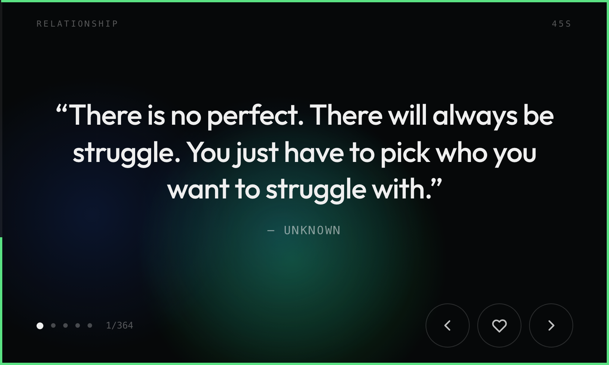

The quote is the whole screen: category top left, how often it turns top right, position and
controls along the bottom. It advances on a timer you set, and the wheel or the arrows move through
it by hand. The heart keeps one, and **Only show favourites** narrows the rotation to those.

Press the button under the wheel for settings on the device: category, how often it turns, favourites
only, and pause. Categories are Inspiration, Developer, Funny, Stoic, Movies, Knowledge, Motivation,
Finance, Relationship, Design, Human nature, Captions, Social and Custom, and it ships with 364
quotes across them. **Your own quotes** are typed in the companion app, one per line with the author
after a dash or a pipe, because that is the only place with a real keyboard.

Favourites are kept in the app's own storage on the device, so they survive a restart. Narrowing to
a set with nothing in it falls back to the wider one rather than leaving the screen blank.

## O-Desk Exchange

A stock market that does not exist, running on your desk.

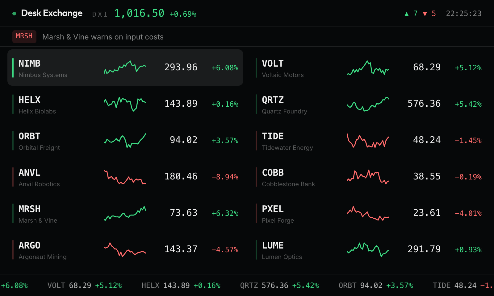

Twelve invented companies, each with its own price, sparkline and session move, and none of them
taking itself seriously: Vapourware Systems, Wheely Fast Motors, Petri & Sons, Beach Sand Semis,
Ship Happens Freight, Big Wind Energy, Clanky Robotics, Piggy Bank Holdings, Impulse Buy Retail, One
More Turn Games, Rock Bottom Mining and Squint Optics. The header carries the Desk Exchange Index,
how many names are up against how many are down, and the clock. The wire under it runs headlines,
and a headline is not decoration: the shock it describes is applied to that company's price, ramping
in over seconds and bleeding off over the next half hour, so a bad story is visible in the chart.
The tape along the bottom rolls the latest print for every name.

**Breaking news** drops in over the board when a story actually lands, with the ticker, which way it
moved the price and the headline itself. It clears itself after eight seconds, an × closes it early,
and touching it opens that company's chart. A story that was already on the wire when you arrived is
history rather than news, so it does not pop. **Breaking news** in the settings turns it off.

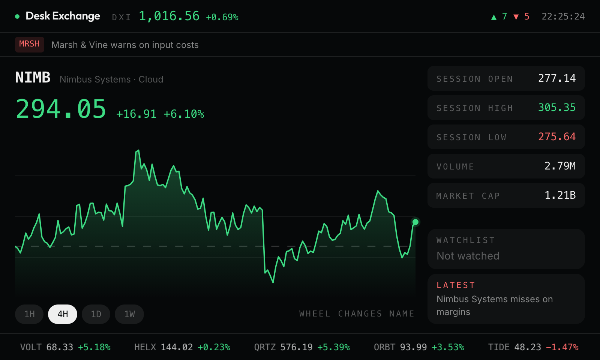

Press 2, or tap a name, for its chart: 1H, 4H, 1D or 1W, with the session open, high, low, volume
and market cap beside it, and the latest headline for that company. The wheel moves through the
names and the chart follows.

Prices are a pure function of the clock rather than a running simulation. The same instant always
gives the same price, which means any span can be charted on demand, the chart and the board never
disagree, and closing the app does not reset the market. Thin names print less often than liquid
ones, so the board does not flash every cell at once.

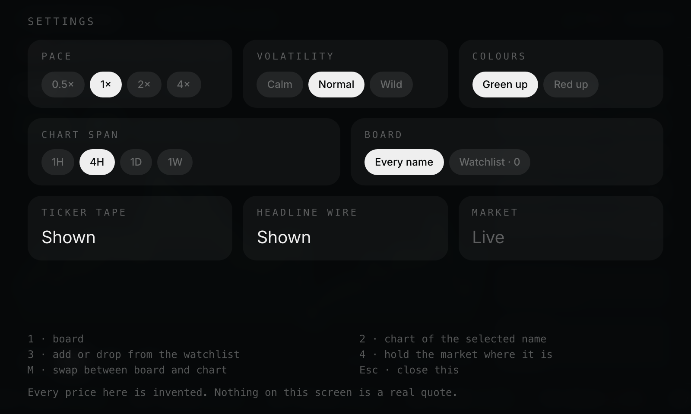

### Controls

| What you do | What happens |
| --- | --- |
| Preset button 1 | The board |
| Preset button 2 | The chart of the selected name |
| Preset button 3 | Add or drop the selected name from the watchlist |
| Preset button 4 | Hold the market where it is |
| Mode, the button past the presets | Swap between board and chart |
| Turn the wheel | Move through the names |
| Button under the wheel | Opens and closes settings |
| Tap a name | Its chart |

### Settings

Pace runs the market at 0.5x to 4x. Volatility is calm, normal or wild. Colours are green for gains
or red for gains, which is how much of Asia reads a board. You can also set the default chart span,
show only your watchlist, and hide the tape or the wire. The watchlist lives in the app's own storage
on the device, so it survives a restart.

Every symbol, price and headline in this app is invented. None of it is a quote for anything real.

## O-Gold Tracker

The live gold price, in the units gold is actually bought in here.

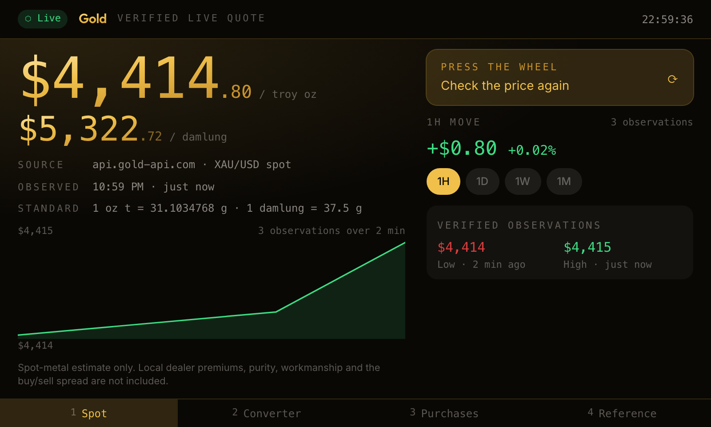

Spot comes from a real provider. The default is gold-api.com's XAU/USD feed, which needs no key; any
endpoint answering with JSON that carries a numeric `price` in USD per troy ounce works, and the
provider URL and optional API key are set in the companion app. Each request goes out over the
phone's proxy and the webview's own connection at the same time, and whichever link is up answers
first.

**The ranges are only what this app has watched.** No free provider offers intraday history, so
rather than print numbers it cannot stand behind, the 1H, 1D, 1W and 1M windows are built from the
app's own observations and say how many there are. Leave it running and the windows fill in. The
same goes for the chart: a short history is a short line.

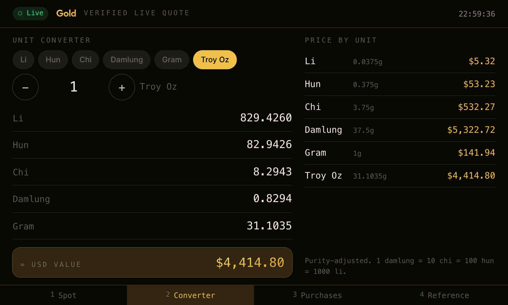

Spot is quoted twice: per troy ounce, which is how the market prices gold, and per damlung, which is
how it is actually bought. Pressing the wheel asks the provider again, with a light running the
width of the screen while the request is out.

The converter covers li, hun, chi, damlung, grams and troy ounces — 1 damlung = 10 chi = 100 hun =
1000 li, and 1 troy ounce = 31.1034768 g. Everything is priced off the purity you select: 24K, 22K,
18K, or a percentage of your own.

Purchases are a private ledger, valued against live spot at the selected purity, showing what each
position cost against what it is worth now. Add one on the device with the steppers — it shows the
premium or discount you are paying against today's spot as you go — and correct the date or the
exact cost in the companion app, which is the only place with a keyboard. The ledger never leaves
your device.

### Controls

| What you do | What happens |
| --- | --- |
| Preset button 1 | Spot |
| Preset button 2 | Unit converter |
| Preset button 3 | Purchases |
| Preset button 4 | Quick reference |
| Mode, the button past the presets | Next view |
| Turn the wheel | Change the window, the amount, or scroll the ledger |
| Press the wheel | Ask the provider for the price again |
| Button under the wheel | Opens and closes data settings |

### Settings

On the device: refresh interval, valuation purity including a custom percentage (which sets the
valuation used by the converter, ledger and reference, not the spot quote itself), the default unit,
and clearing the observation history. In the companion app: the provider URL, the API key, and the
purchase ledger itself.

Everything shown is a spot-metal estimate. Dealer premiums, workmanship and the buy/sell spread are
not included.

## O-Map

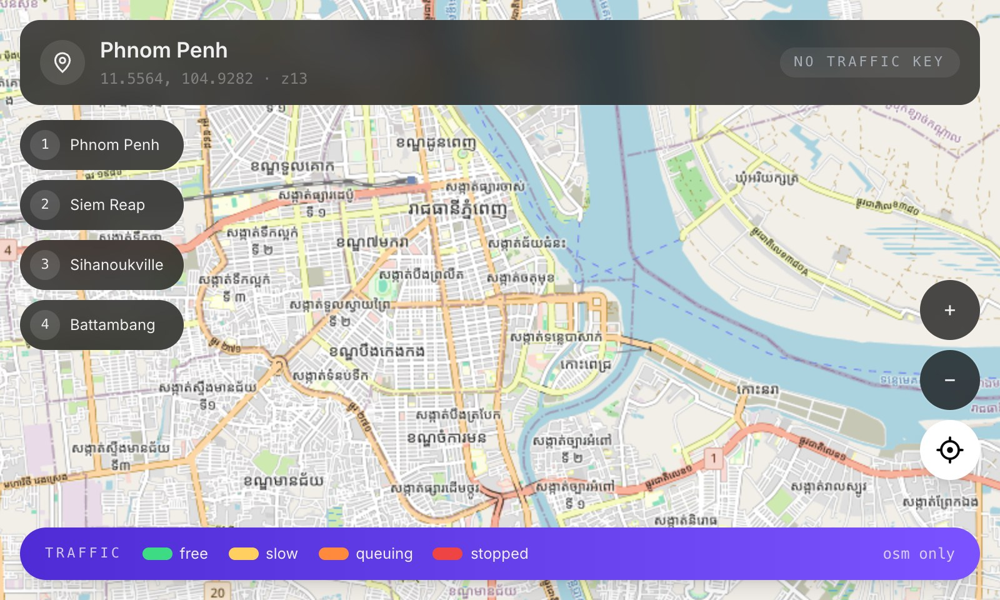

Cambodia on the dash.

The map is OpenStreetMap, a tile at a time, fetched through the phone rather than by the screen
itself: the device has no internet of its own, so every 256 pixel square comes back as bytes over
the same link the music does, and is kept in memory once it has arrived. The layout is the web
mercator grid every slippy map uses, so dragging moves the country under your finger, the wheel
steps the zoom, and the two round keys on the right do the same for a thumb.

The four presets are four cities: Phnom Penh, Siem Reap, Sihanoukville and Battambang, with **Mode**
for the whole country at once. The screen itself stays out of the way: the cities are in the
settings rather than as chips over the map, and the only things on it are the card along the top,
which names where the middle of the screen is to four decimal places and says whether traffic is
live, the two zoom keys and the recentre key.

**Traffic** is TomTom's flow layer, drawn over the map as a second set of tiles: green where it
moves, red where it does not, with the legend along the bottom. It needs a key, which TomTom's free
tier gives away, and it goes in the companion app under O-Map, since a Car Thing has nowhere to type
one. Without a key the map is still a map, and the chip in the corner says so rather than pretending.

Four **map styles**. Streets is OpenStreetMap as everyone knows it. **Minimal** is pale grey roads
on almost no colour, which leaves the traffic as the only thing on the screen with any in it, and
**Night** is the same map dark. Plain is the flatter humanitarian style. The first two come from
Esri's canvas basemaps, which number their tiles the other way round, y before x, and the app knows
it.

The wheel button opens the settings on the device: which city it opens at, the map style, and
whether traffic is drawn. Credit goes with the style: OpenStreetMap contributors throughout, Esri,
HERE and Garmin for the two canvas ones.

### Controls

| What you do | What happens |
| --- | --- |
| Preset buttons 1-4 | Jump to Phnom Penh, Siem Reap, Sihanoukville or Battambang |
| Mode | The whole country |
| Turn the wheel | Zoom in and out |
| Drag the map | Pan |
| Button under the wheel | Opens and closes the settings |

## O-Photos

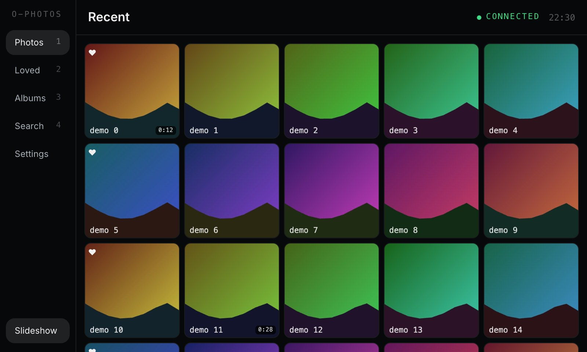

An Immich library on the dash, as a photo frame rather than a web client.

The screen has no network of its own, so every request goes through the phone: one fetch helper over
the daemon's tunnel, the API key in a header and never in a url, and the browser's CORS rules never
enter into it, because the browser is not the one asking. The server address and the key are typed
in the companion app under O-Photos, since a Car Thing has nowhere to type a url.

The navigation is a rail of glyphs down one edge, no wider than the icons: a grid, a heart, a
folder, a lens, a gear and a play triangle. Everything the screen has goes to the pictures.

**Recent, Loved and Albums** are the first three presets, and **preset 4 turns the screen** a
quarter at a time for a frame stood on its side: the app is laid out at the swapped size and rotated
into place, so the navigation moves to the edge the buttons are on, the grid drops from five columns
to three and the albums from four to two. Search is a touch away in the navigation.

**Which photos** sifts the library by shape: all, landscape only, or portrait only, which is what a
turned screen wants. It is a key in the viewer too, beside the heart, reading All, Wide or Tall, and
the picture under your eye stays there when the shape changes if it still fits. Immich cannot search by shape, so this sifts what comes back rather than asking
for it, and a page can arrive nearly empty before the next fills the screen. Pictures come back thumbnail first, forty
at a time, and the next page loads as the grid nears its end. No more than four requests are in
flight at once, and the one you are looking at goes to the front of the queue.

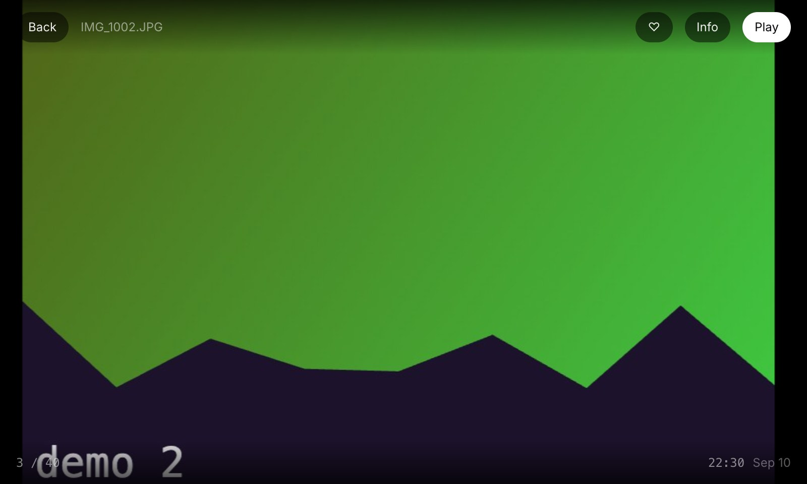

Touching a picture opens it at preview size. The wheel and the arrow keys move through, the file,
place, camera, size and date sit behind **Info**, and the heart writes the favourite back to Immich
when the key is allowed to. If it is not, the app says so rather than pretending it worked.

**The slideshow** runs from whichever list is open, keeping one picture ahead of itself and no
further. Five transitions, with a Ken Burns drift as the default, and everything holds still when
the system asks for reduced motion. Shuffle is a Fisher-Yates order taken once rather than a coin
flip per picture; loop is a setting; the chrome fades out until a touch brings it back, which is
ambient mode with the sidebar gone.

**The cache** is IndexedDB. Every picture that arrives is kept with the time it was last wanted, and
when the box passes its limit the oldest go until it is back under four fifths rather than the whole
thing being emptied. The settings say what is in it and offer to clear thumbnails, previews or
everything. Object urls are handed back as the grid moves on, so a slideshow can run for hours
without the tab growing.

A **demo library** is built in, drawn on a canvas rather than downloaded, so the app can be looked
at before a key exists.

**On video:** the tunnel hands back whole responses rather than byte ranges, so a video plays only
by pulling the entire file through the phone first. This version shows videos in the grid with their
length and opens their still, and leaves playing them to Immich itself.

### Controls

| What you do | What happens |
| --- | --- |
| Preset button 1 | Recent |
| Preset button 2 | Loved |
| Preset button 3 | Albums |
| Preset button 4 | Turn the screen a quarter |
| Mode | Start or stop the slideshow |
| Turn the wheel | Scroll the grid, or move through the viewer |
| Space | Pause or resume the slideshow |
| I | What is known about the picture |
| Back | Out of the viewer, or into the settings |

## Working on it

```sh
bun run dev <slug>                           # run one app against a connected Car Thing
bun run --cwd apps/MusicPlayerV1 push        # build and install onto the device
bun run --cwd apps/MusicPlayerV1 typecheck   # types for src, settings and extension
bun run check                                # the whole gate: typecheck, build, bundle, catalog
bun run bump MusicPlayerV1 patch -m "note"   # move the version and open a changelog entry
```

Each app has a port of its own, so they can all run at once and a bookmark keeps working:

| App | Dev server |
| --- | --- |
| O-Music Player | http://localhost:5173 |
| O-Clock | http://localhost:5174 |
| O-Desk Exchange | http://localhost:5175 |
| O-Gold Tracker | http://localhost:5176 |
| O-Network Monitor | http://localhost:5177 |
| O-Quote Flow | http://localhost:5178 |
| O-Map | http://localhost:5179 |
| O-Photos | http://localhost:5180 |

Nothing links one to another: each is its own page, so switching between them means changing the
address. On the device that job belongs to the launcher, which five fast presses of Mode returns you
to. If a port is already taken vite quietly takes the next free one and says so on startup.

Pushing to main publishes the catalog. A published version never changes, so shipping anything means
bumping first — `check` refuses a change to an app that has not been bumped.

> The `push` script resolves its own path without decoding it, so it fails if the repository lives in
> a folder whose name contains spaces.
