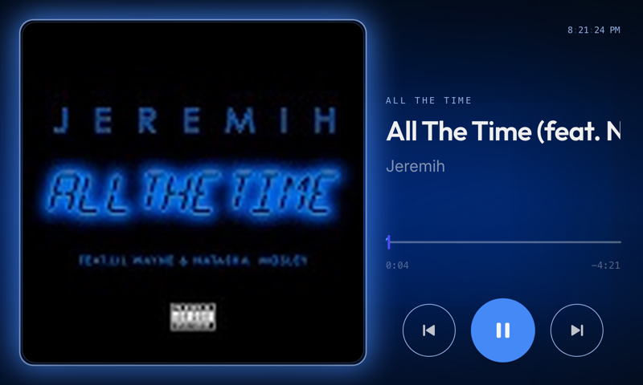
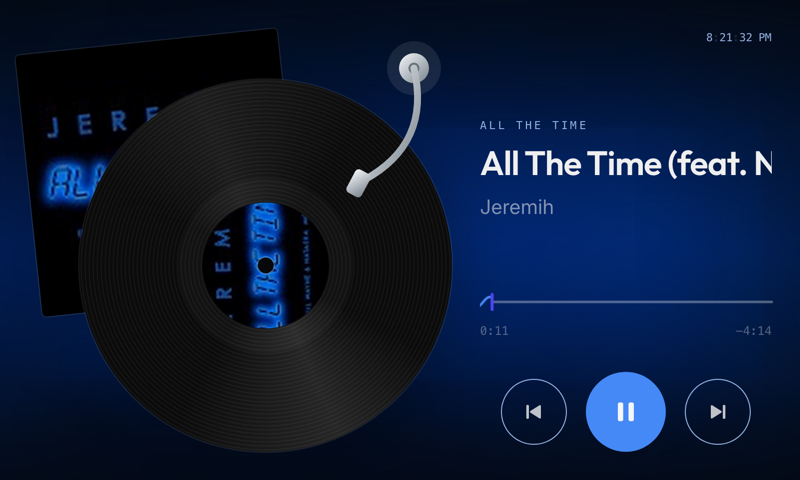
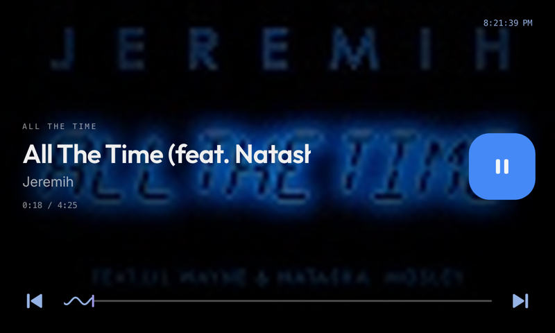
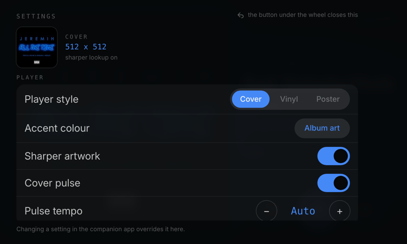
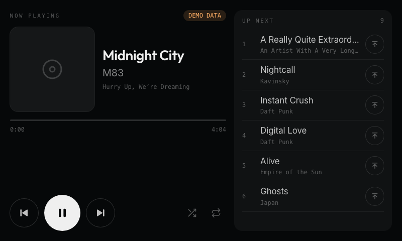

# Ousa apps for the Car Thing

Three apps for the [Spotify Car Thing](https://bridgething.com), published from one source: a music
player, a queue controller, and a network monitor. Add the source once and all three are available.



| App | What it does |
| --- | --- |
| **Music Player** | Now playing, in three styles, coloured by the album art |
| **Queue Manager** | The up-next queue, with select, bump and shuffle/repeat |
| **Network Monitor** | Link status, latency and measured throughput |

## Put it on your Car Thing

Your device needs [bridgething](https://bridgething.com) installed, with its companion app paired
to your phone. Then:

1. Open the **companion app** on your phone.
2. Go to the app store section and **add a source**.
3. Paste this url:

   ```
   https://ousachea.github.io/Ousa-Music-Player-v1/catalog.v1.json
   ```

4. The apps appear in the list. Install the ones you want.
5. Open them from the device's launcher.

Updates show up in the same place. Music Player can also tell you when it is behind: open its
settings on the device and press **Check** under *Software update*.

> Music Player and Network Monitor each ask for `net.proxy`. Music Player uses it to fetch a sharper
> copy of the album art than the device receives on its own, which you can turn off in its settings;
> Network Monitor uses it to time the requests it measures with. Queue Manager asks for nothing.

## Music Player

### The three player styles

Switch between them in the settings, under **Player style**.

### Cover


The album at full height with the track beside it. The artwork's own colour drives the play button,
the seek bar and the button outlines, and a glow pulses around the cover's edge. The blurred cover
sits behind everything, and both its strength and its slow drift are adjustable.

### Vinyl



The sleeve tucked behind a record that carries the artwork as its label. The platter turns while the
track plays and holds its angle when you pause; the tonearm rests on the outer grooves and lifts off
when the music stops.

### Poster



The artwork fills the whole screen with the track laid over it. The progress line is drawn as a wave
for the part you have played and a flat line for the rest, and the wave travels while the music runs.
This is the style that benefits most from the sharper artwork lookup.

### Controls

| What you do | What happens |
| --- | --- |
| Preset button 1 | Previous track |
| Preset button 2 | Play or pause |
| Preset button 3 | Next track |
| Mode, the button past the presets | Cycle the player style |
| Turn the wheel | Volume, or scrub the track — your choice in settings |
| Press the wheel once | Play or pause |
| Press it twice | Next track |
| Press it three times | Previous track |
| Button under the wheel | Opens and closes settings |
| Tap the play button | Play or pause |
| Drag the progress bar | Seek |

A press waits a moment to see whether another one follows, so play/pause from the wheel is very
slightly delayed. The on-screen button is instant.

### Settings



Press the button under the wheel to open them on the device. The list only shows what the style you
picked can actually use, so switching to Poster hides the backdrop and pulse rows it does not draw.

- **Player** — style, accent colour, sharper artwork, and the cover pulse with its tempo
- **Controls** — what the wheel does, how far each click seeks, and whether the seek bar is a line or a wave
- **Backdrop** — how strongly the blurred art tints the screen, and how far it drifts
- **Display** — animations, and whether the time counts down or shows the track length
- **Clock** — position, size, 12 or 24 hour, and seconds
- **About** — check whether a newer version has been published

Everything is also editable from the companion app, which has room for longer explanations. Whichever
one you changed last wins.

## Queue Manager

The up-next queue on its own screen, so you can steer what plays without picking up your phone.



The current track sits on the left with its artwork, progress and transport, and the queue fills the
right in a list you can scroll by touch or with the wheel. Tapping a row jumps straight to that
track; the button beside it pushes that track to the front of what plays next. Shuffle and repeat
are there too.

**What the player will and will not allow.** It can read the queue, jump to an index, and queue a
track to play next, so those work. It exposes no way to *remove* an entry, and re-queueing without a
remove would duplicate a track rather than move it, so remove and free reordering are reported as
unavailable rather than faked. Bumping a track to play next is the honest version of moving it up.

With no phone attached it falls back to a mock queue, marked **DEMO DATA**, which is also what
exercises the awkward cases: titles and artists long enough to truncate, and a queue longer than the
panel.

## Network Monitor

A second app in this source: a live view of the device's connection.


It shows link status (connected, degraded, offline), round trip latency, measured download
throughput, the connection kind and whether it is metered, your public address, and how long the
link has been up as this app has observed it. The graph keeps the last 60 seconds.

**What is measured, and what is not.** The daemon proxies HTTP and reports the link kind, but it
exposes no interface counters. So latency and download are measured by timing real transfers, which
means download is what the app can pull *through the proxy* rather than the line's ceiling, and
throughput sampling pauses itself on a metered link. Upload and the local address are reported as
unavailable rather than estimated.

**To make those real, a desktop extension would need to expose `net.interface`:**

- `rx_bytes` and `tx_bytes` per interface, sampled on a timer, so throughput needs no traffic of its own
- the active interface name, its local address and its link speed
- the timestamp the link last came up, for real uptime rather than observed uptime

The app already routes everything through a provider in `src/net.ts`, so an extension-backed provider
drops in beside the probe one without touching the dashboard.

## Working on it

```sh
bun run dev                                  # run against a connected Car Thing
bun run --cwd apps/MusicPlayerV1 push        # build and install onto the device
bun run --cwd apps/MusicPlayerV1 typecheck   # types for src, settings and extension
bun run check                                # the whole gate: typecheck, build, bundle, catalog
bun run bump MusicPlayerV1 patch -m "note"   # move the version and open a changelog entry
```

Pushing to main publishes the catalog. A published version never changes, so shipping anything means
bumping first — `check` refuses a change to an app that has not been bumped.

> The `push` script resolves its own path without decoding it, so it fails if the repository lives in
> a folder whose name contains spaces.
