# Ousa apps for the Car Thing

Nine apps for the [Spotify Car Thing](https://bridgething.com), published from one source. Add the
source once and all of them are available.


| App | What it does |
| --- | --- |
| **O-Music Player** | Now playing, in ten styles, coloured by the album art, on a screen that turns |
| **O-Clock** | A clock in ten faces, eight timers, a stopwatch and an alarm |
| **O-System Monitor** | CPU, GPU, memory, network and storage for your machines |
| **O-Quote Flow** | A quote of the moment, with favourites and your own lines |
| **O-Desk Exchange** | A fictional stock market: invented tickers, headlines and prices |
| **O-Gold Tracker** | Live gold spot, Khmer weight conversion and a private purchase ledger |
| **O-Map** | Cambodia on the dash, with live traffic when you bring a key |
| **O-Photos** | An Immich library on the dash, as a photo frame |
| **O-Pixel Art** | A glowing LED wall: animated scenes, and pixel art you draw yourself |

## Put it on your Car Thing

Your device needs [bridgething](https://bridgething.com) installed, with its companion app paired
to your phone. Then:

1. Open the **companion app** on your phone.
2. Go to the app store section and **add a source**.
3. Paste this url:

   ```
   https://ousachea.github.io/Ousa-Music-Player-v1/catalog.v1.json
   ```

4. Install the apps you want and open them from the device's launcher.

Updates show up in the same place. Music Player can also check for one under **Settings → Software
update**.

> Music Player and System Monitor ask for `net.proxy`. Music Player uses it for sharper album art,
> missing artist names and explicit tags (all optional in its settings); System Monitor uses it to
> time its measurements.

> System Monitor also ships a desktop extension, which reads the computer your Car Thing is plugged
> into. Install it from the bridgething desktop app on that computer, which asks you to allow the
> exact system tools it runs.

## O-Music Player

Ten player styles, all tinted by the album art, with music notes drifting up over them (**Display →
Floating notes**). Switch styles with **Mode** or in the settings; a small tag at the bottom names
the current one. Track changes cross-fade the blurred background, and Vinyl and CD swap in a new
record or disc.

### Vinyl

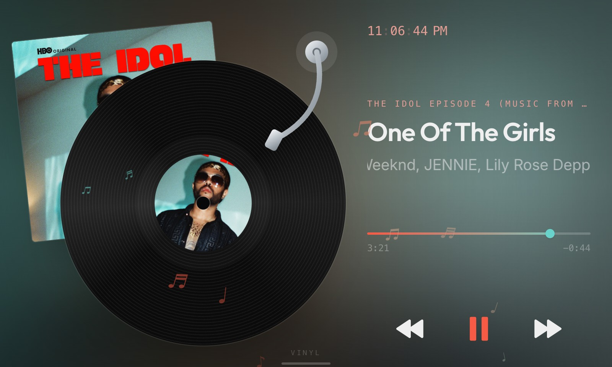

A record that turns while the track plays and holds its angle on pause. **Layout** has three
arrangements, and tapping the middle of the record steps through them:

- **Turntable**: the record on the platter, with a tonearm and the sleeve behind it. Touch the sleeve
  to bring it forward (**In front** in settings).
- **Sleeve**: the cover flat on one side, the record half pulled out of it.
- **Picture disc**: the cover pressed into the whole record, run off the edge of the screen, with a
  clear ring and a see-through hole. The track sits beside it under a centred clock, with a tick
  scrubber that pulses while playing and round transport buttons.

**Record colour** presses the disc in black, the album's colour, or a marble of its two colours.

### CD

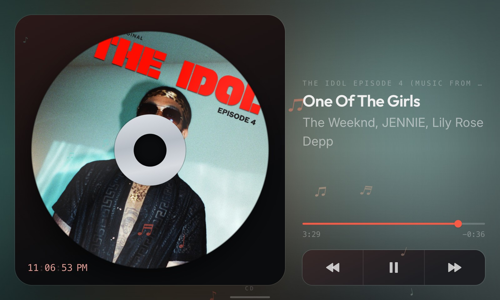

The album printed on a spinning disc with a metal clamping ring, in a tray tinted by the album's
colour. The track, progress bar and a three-part transport sit beside it.

### Cassette

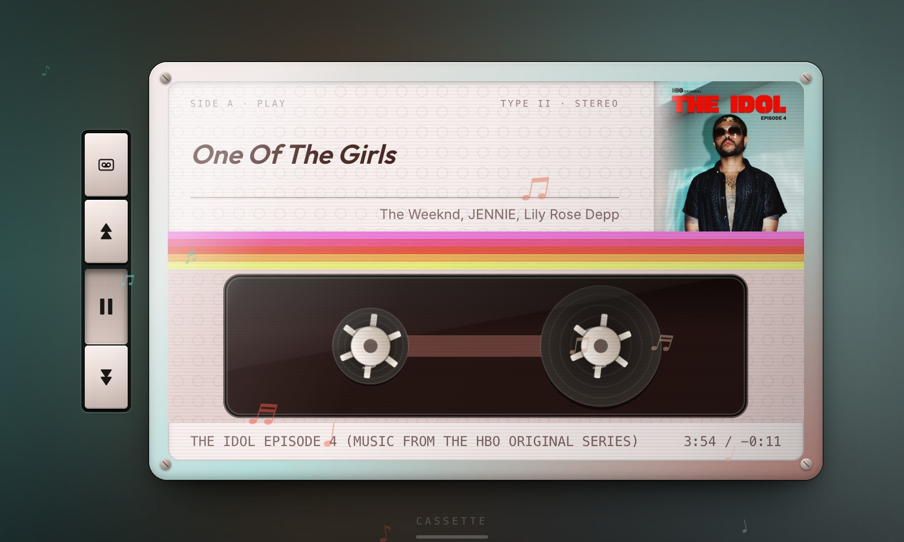

A tape in a deck, in three designs (**Tape design**, or the fourth deck key):

- **Written**: a handwritten cream label with the rainbow band and a window onto the spools.
- **Printed**: the cover as a sticker label on a brushed metal shell.
- **Clear**: a see-through shell showing the spools, hubs and tape guides.

The whole tape is coloured from the cover, and each track gets its own pattern. The spools are the
progress bar: the left empties as the right fills. The play key latches down while playing.
**Artwork on the label** adds the cover to the written label.

### Dial

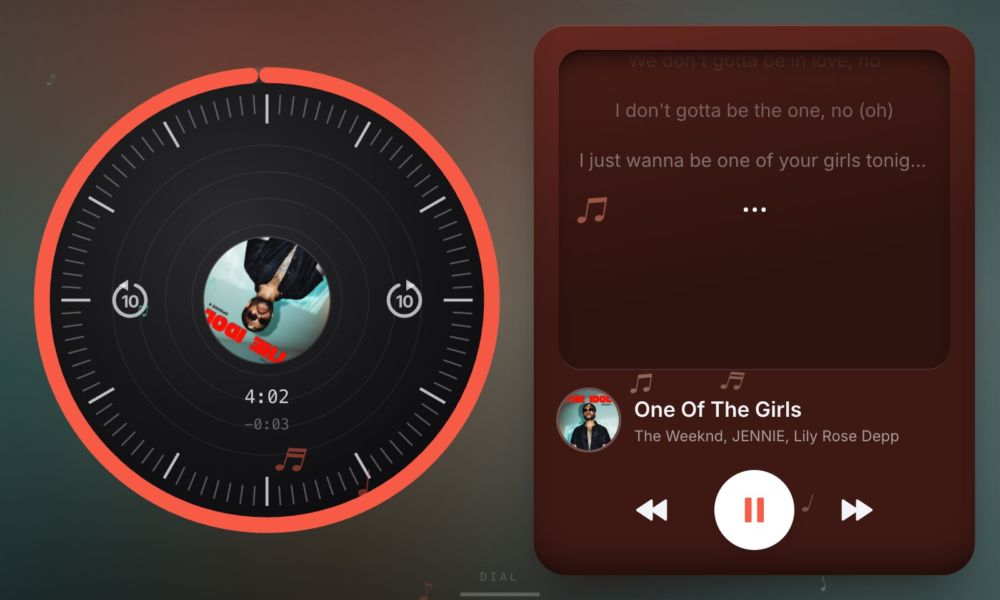

A jog wheel beside a card. Progress runs round the dial as an arc in the album's colour, with the
cover turning in the middle and ten-second skip keys either side. The card shows scrolling lyrics
(or the album and track when there are none), and the transport underneath.

### Stereo

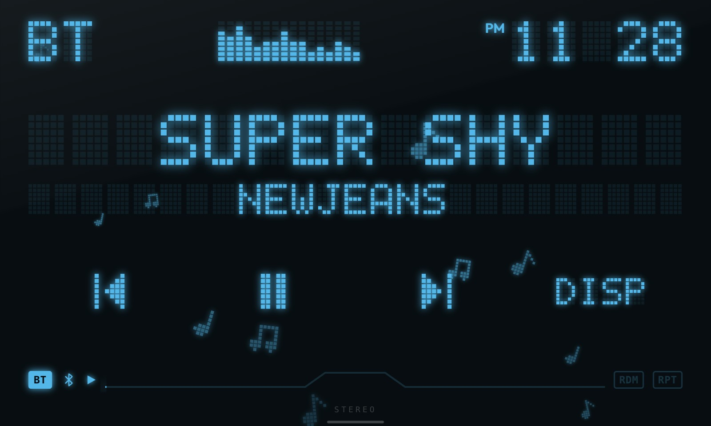

A car head unit's dot matrix display across the whole screen, with a level meter, a scrolling
title, a line that steps through artist, album and time (tap it or **DISP**), shuffle and repeat
badges, and a volume readout on the display itself.

- **Display colour**: the album's colour, ice, amber, red, green, white, or rainbow. Tap the level
  meter to step through them.
- **Light or dark**: the glowing night display, a crisp daylight one with dark dots on pale glass, or
  **Auto** (light in the AM, dark in the PM, by the phone's clock). Tap the clock to switch.

### Flow

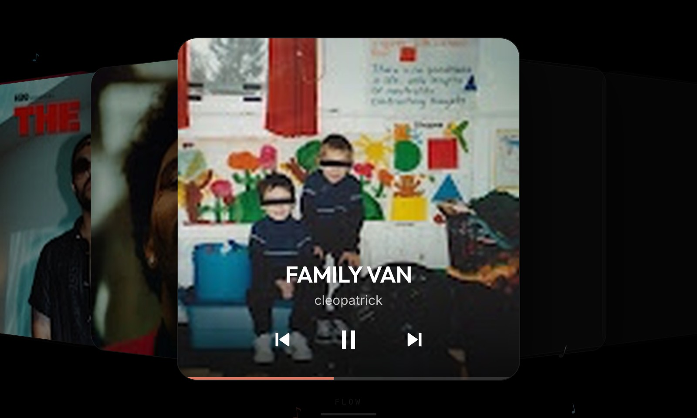

Cover flow: the current cover in the middle, up next to the right and just played to the left. Tap
the middle to play or pause, or a side cover to jump to it. With nothing queued, the buttons fill the
empty right side. **Background** is a dark wash of the album's colours, or black.

### Pocket

A pocket music player held sideways: a full-height screen with the cover, track and progress bar,
and a click wheel beside it. Turned upright, the screen stands above the wheel.

- **The wheel**: top opens the queue, left and right skip, bottom and centre play or pause, and
  dragging round the ring turns the volume, shown on the screen.
- **The screen**: tap it to show just the artwork, tap again to bring the track back.
- **Body colour**: silver or black.

### Poster

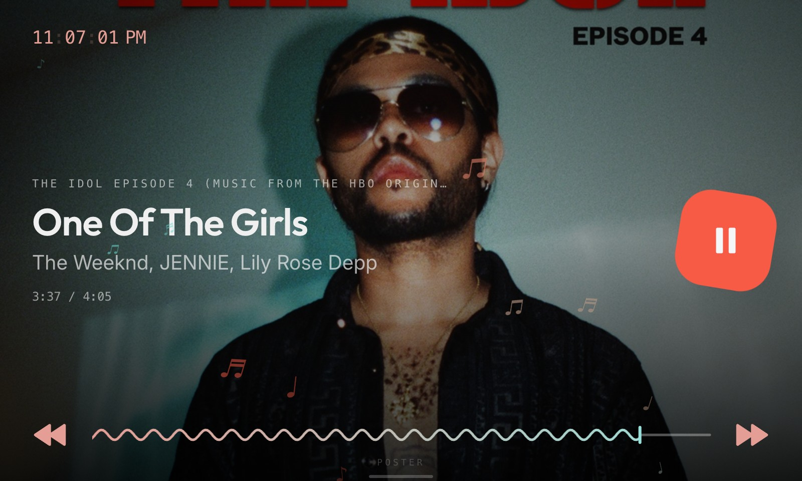

The artwork fills the screen with the track laid over it, a slowly turning play button, and a wavy
progress line that travels while the music runs.

### Cover


A phone lock screen layout: the art, the track, a progress bar, the transport and its own volume
slider. Options: **Panel behind the track**, **Volume slider**, **Art to the edge**, and **Art pulse**
with a tempo.

### Lyrics

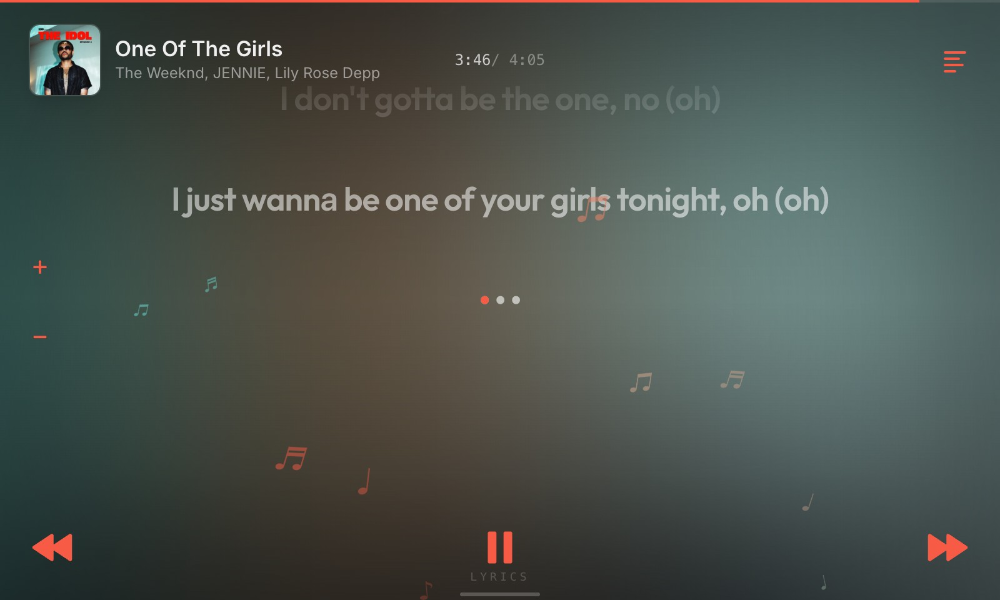

Timed lyrics with the current line centred and filling with the album's colour as it's sung. Long
lines shrink rather than get cut. Tap a line to play from it; the wheel scrolls the words. Progress
runs as a hairline along the top. The art and track sit in a corner you pick (**Track corner**), and
plus and minus set the text size. Unsynced lyrics show as a page; with none, the art and track show
instead.

### The queue

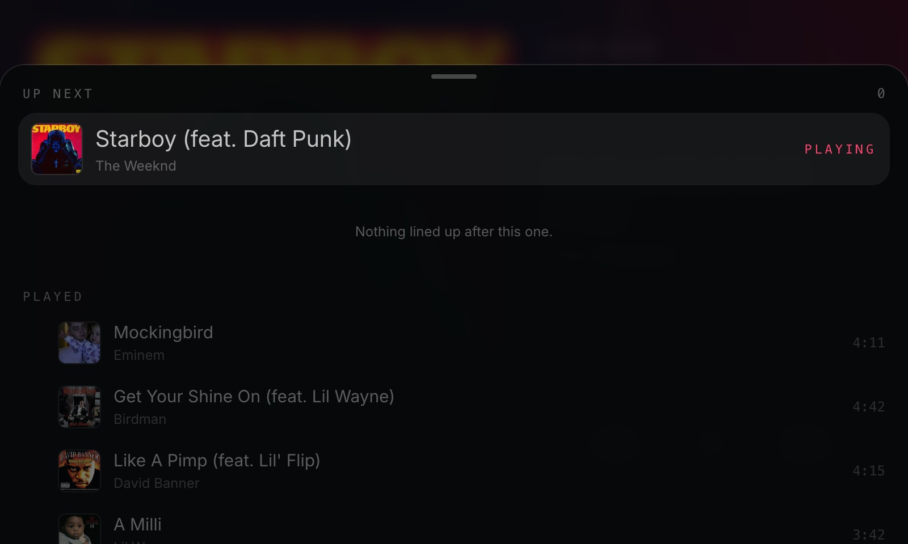

Swipe up from the bottom edge for the phone's queue: what's playing, what's next and what just
played. Tap a row to skip to it. Swipe down or press Back to close.

### Controls

| What you do | What happens |
| --- | --- |
| Preset button 1 | Previous track |
| Preset button 2 | Play or pause |
| Preset button 3 | Next track |
| Preset button 4 | Turn the screen a quarter: 0, 90, 180, 270 |
| Mode, the button past the presets | Cycle the player style: Cover, Vinyl, CD, Cassette, Dial, Stereo, Flow, Pocket, Poster, Lyrics |
| `5` on a keyboard | The same, for working against the dev server |
| Turn the wheel | Volume, or scrub the track — your choice in settings |
| Press the wheel once | Play or pause |
| Press it twice | Next track |
| Press it three times | Previous track |
| Button under the wheel | Opens and closes settings |
| Tap the play button | Play or pause |
| Drag the progress bar | Seek |
| Swipe across the screen | Next track, or previous if you swipe the other way |
| Swipe up from the bottom edge | Open the queue |
| Swipe it back down, or Back | Close the queue |

### Screen orientation

Preset 4 (or **Display → Screen rotation**) turns the screen for a device mounted on its side. Each
style lays itself out for portrait rather than stretching, and the preset markers and swipes follow
the physical buttons.

### Settings

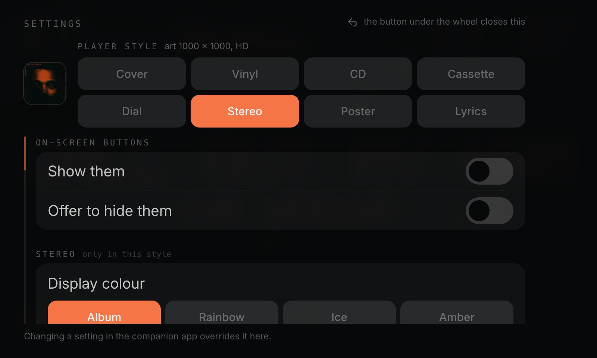

Press the button under the wheel. The styles sit at the top as a grid; tap one to switch to it and
see its own settings. Below are the general ones:

- **On-screen buttons**: show the transport, and whether to offer hiding it
- **Player**: accent colour, HD album art
- **Controls**: what the wheel does, seek step, seek bar style and playhead dot
- **Backdrop**: intensity, blur and drift of the blurred art
- **Display**: animations, floating notes, rotation, time remaining
- **Clock**: position, size, 12/24 hour, seconds
- **About**: check for updates

With the on-screen buttons off, small markers at the screen edge show what each preset does. Every
setting is also in the companion app; the last change wins.

## O-Clock

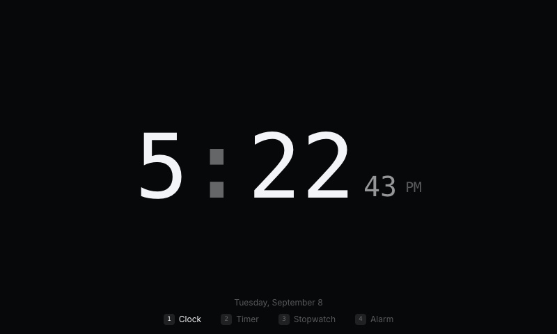

A clock, timers, a stopwatch and an alarm, one per preset.

- **1, the clock**: ten faces (Digital, Digital + Date, Minimal, Border, Flip, Analogue, Calendar,
  World, Binary, Word). Press 1 again or turn the wheel to change face.
- **2, timers**: Countdown, Circular, Bezel, Pomodoro, Interval, Kitchen, Preset and Multi.
- **3, stopwatch**: hundredths, with laps.
- **4, alarm**: set it, switch it on, and it survives a restart.

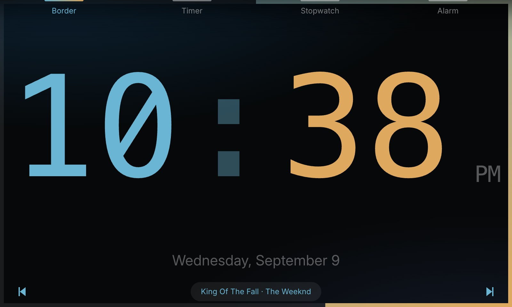

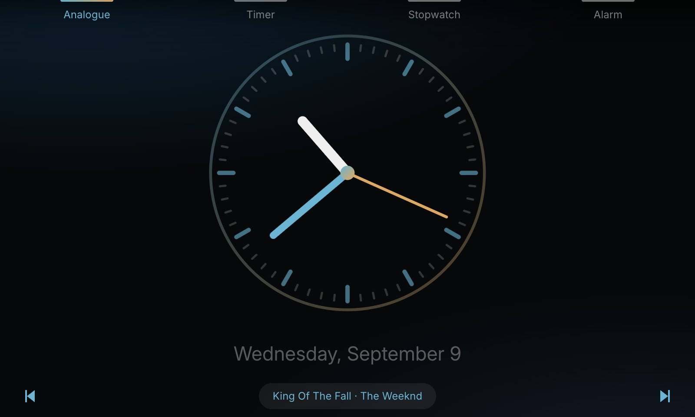

The wheel button opens settings for the current screen. Options include a flashing colon, face size
(up to Fill), screen rotation, eight colour pairs, or **Follow the album art**. A now-playing strip
with previous, play and next sits along the bottom while music plays. Time comes from the phone.

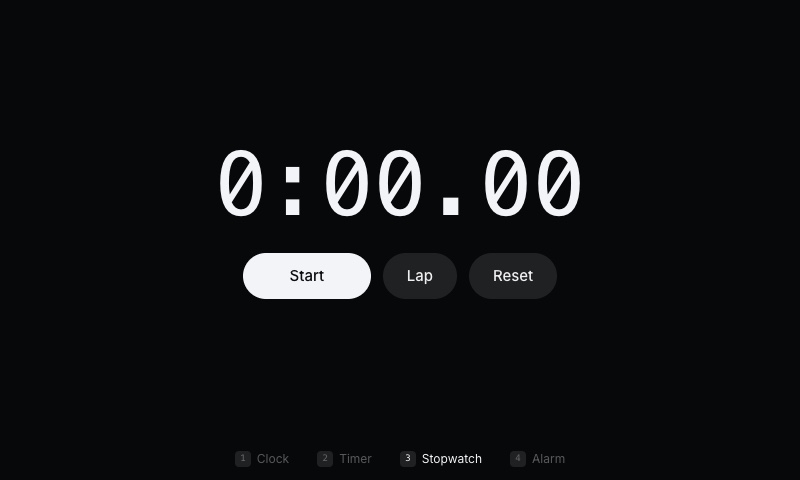

## O-System Monitor

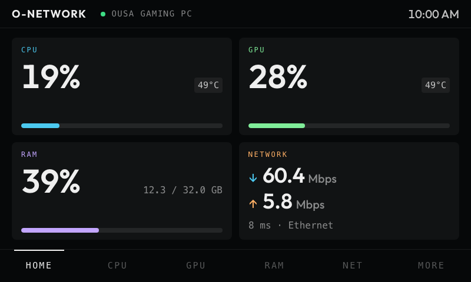

A small hardware monitoring station: CPU, GPU, memory, network, storage and processes for the
machines around you, one at a time, on the Car Thing.

- **Home** shows the four that matter most for the device you're watching; a phone with no CPU data
  gets battery and storage in their place. **Home style** draws them as cards with bars; as rings, a
  gradient arc round each figure that eases to every new reading; or as widgets, tiles in their own
  colours with a soft light drifting slowly across each, network wide along the bottom and the disk
  as a row of slats. Swipe or turn the wheel for more widgets: the weather with an animated sky,
  Claude Code's tokens today and this week, read from its own logs on the computer,
  a clock (digital, LED or analog), a calendar (month, week or day), what the phone is playing with
  its controls, an animated battery with its health and cycle count, the sun's day as a glowing arc,
  every core, the busiest apps, uptime, displays and any other drives. Tap the clock or the calendar
  to change its face. Cards and rings have the same pages after their first.
- **CPU, GPU, RAM, network and disk** each have their own screen, opened from their tile on Home; CPU shows every core, and DISK every
  drive with its space and read and write speed.
- **The gear** beside the clock reaches Processes (a radar of the busiest eight, or a list with share bars and trends), Devices, Settings and Debug, which shows the
  raw telemetry.
- A device that goes quiet shows **Offline** with how long ago it last reported, and a banner says so
  when it comes back.

**Live**, the default, shows the computer your Car Thing is plugged into. Install O-System Monitor in
the bridgething desktop app and allow its extension: it reads the machine and reports every one to
five seconds, as Refresh is set, while the app is on screen, and does nothing while it is not. Nothing
needs admin rights:

- **macOS:** CPU per core and load, memory as Activity Monitor counts it, GPU load, Wi-Fi or
  Ethernet speed and signal, drives with read and write speed, battery health, displays and the
  busiest processes. No temperatures, which macOS keeps behind admin rights.
- **Windows:** the same through one PowerShell that stays running, plus the live CPU clock, and for
  an NVIDIA card its temperature, clock, power and fan. No CPU temperature, which needs admin rights.
- **Linux:** the same from `/proc` and `/sys`, plus CPU, drive and GPU temperatures, which Linux
  does share; NVIDIA through `nvidia-smi`, AMD through its driver's files.

Phones cannot run the extension: an iPhone or Android agent would be an app of its own. Live also
lists the Car Thing's own link.

**Mock** runs four pretend machines (a Windows gaming PC, a MacBook, a Linux server that drops off
now and then, and an Android phone). Settings also choose the refresh rate, °C or °F, Mbps or MB/s,
and how much history the graphs keep.

### Controls

| What you do | What happens |
| --- | --- |
| Preset button 1 | Home; pressed again on Home, the next page of widgets |
| Preset button 2 | CPU |
| Preset button 3 | GPU |
| Preset button 4 | Turn the screen a quarter: 0, 90, 180, 270 |
| Mode | Next home style: cards, rings, widgets |
| Turn the wheel | Scroll a list or the widget pages, or step through the screens |
| Press the wheel | Hide or show the top bar; on a list, choose |
| Tap the gear | Processes, devices, settings and debug |
| Tap a tile on Home | That reading's own screen |
| Swipe across the screen | Next or previous screen |
| Back | The screen before |
| Tap the device name | Devices |

## O-Quote Flow

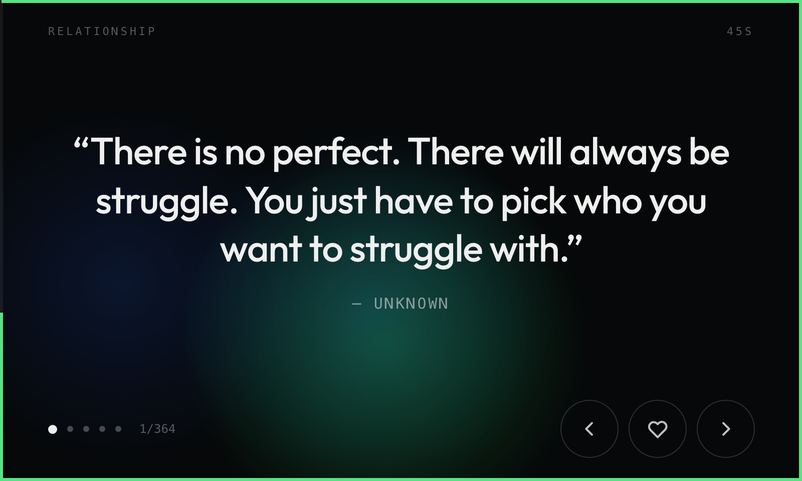

A full-screen quote that changes on a timer. The wheel moves through them, the heart saves
favourites, and 364 quotes ship across 14 categories. Add your own in the companion app, one per line
with the author after a dash or pipe.

## O-Desk Exchange

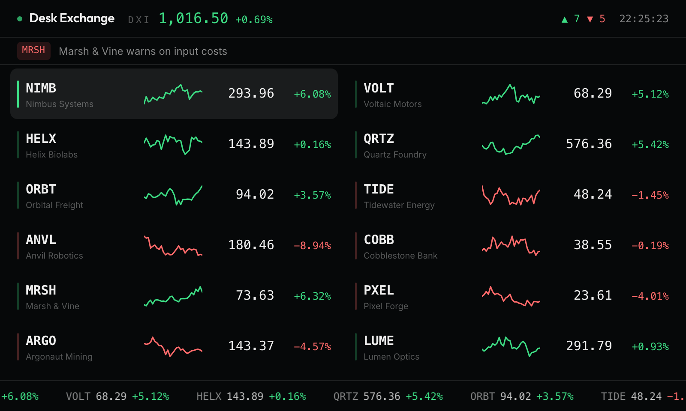

A made-up stock market of twelve joke companies, with an index, a headline wire that actually moves
prices, a ticker tape, and breaking news pop-ups. Prices are computed from the clock, so they stay
consistent across restarts.

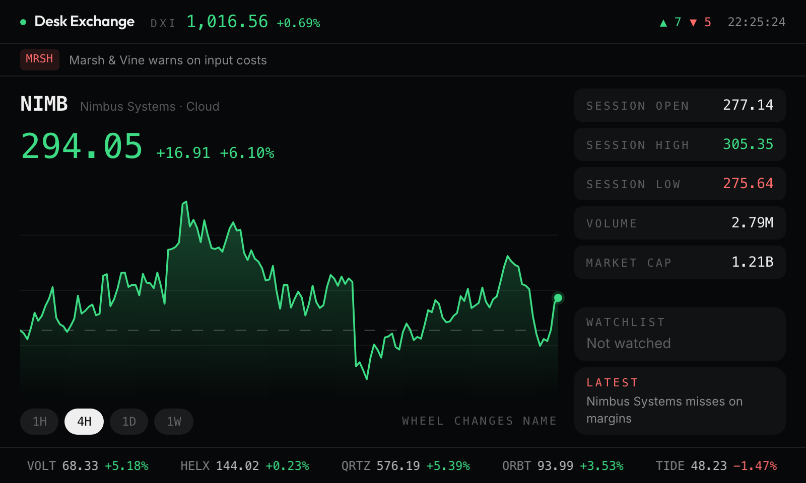

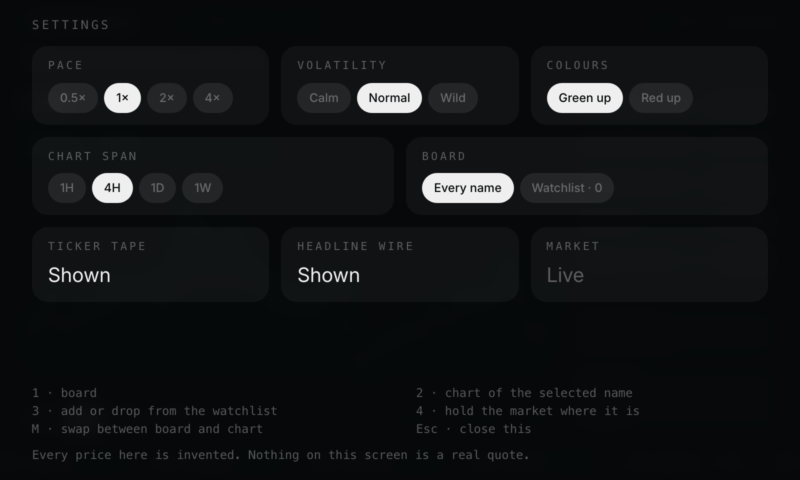

### Controls

| What you do | What happens |
| --- | --- |
| Preset button 1 | The board |
| Preset button 2 | The chart of the selected name |
| Preset button 3 | Add or drop the selected name from the watchlist |
| Preset button 4 | Hold the market where it is |
| Mode, the button past the presets | Swap between board and chart |
| Turn the wheel | Move through the names |
| Button under the wheel | Opens and closes settings |
| Tap a name | Its chart |

### Settings

Pace (0.5x to 4x), volatility, gain colour (green or red), default chart span, watchlist only, and
hiding the tape or wire. Everything in this app is invented.

## O-Gold Tracker

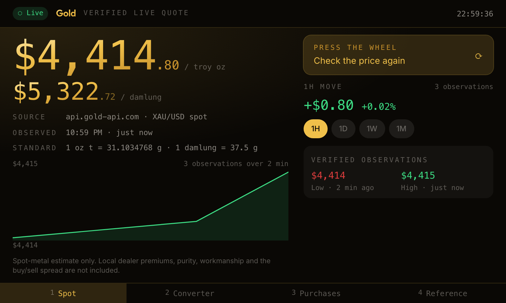

Live gold spot per troy ounce and per damlung, from gold-api.com by default (any JSON endpoint with a
USD `price` works). The 1H to 1M ranges are built from what the app has observed, so they fill in
over time.

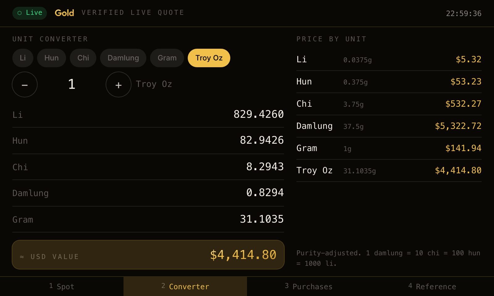

A converter for li, hun, chi, damlung, grams and troy ounces at 24K, 22K, 18K or a custom purity, and
a private purchase ledger valued against live spot. Prices are spot estimates without dealer
premiums.

### Controls

| What you do | What happens |
| --- | --- |
| Preset button 1 | Spot |
| Preset button 2 | Unit converter |
| Preset button 3 | Purchases |
| Preset button 4 | Quick reference |
| Mode, the button past the presets | Next view |
| Turn the wheel | Change the window, the amount, or scroll the ledger |
| Press the wheel | Ask the provider for the price again |
| Button under the wheel | Opens and closes data settings |

### Settings

On the device: refresh interval, purity, default unit, clearing history. In the companion app: the
provider URL, API key and the ledger.

## O-Map

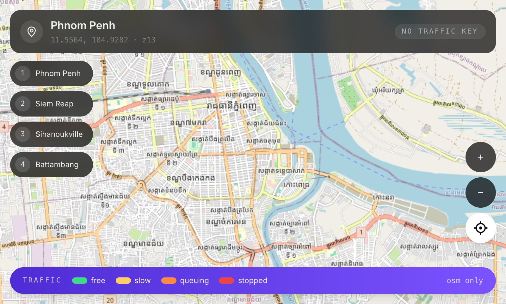

OpenStreetMap of Cambodia, fetched through the phone. Drag to pan, wheel to zoom. Four map styles
(Streets, Minimal, Night, Plain) and optional TomTom live traffic with a free key from the companion
app.

### Controls

| What you do | What happens |
| --- | --- |
| Preset buttons 1-4 | Jump to Phnom Penh, Siem Reap, Sihanoukville or Battambang |
| Mode | The whole country |
| Turn the wheel | Zoom in and out |
| Drag the map | Pan |
| Button under the wheel | Opens and closes the settings |

## O-Photos

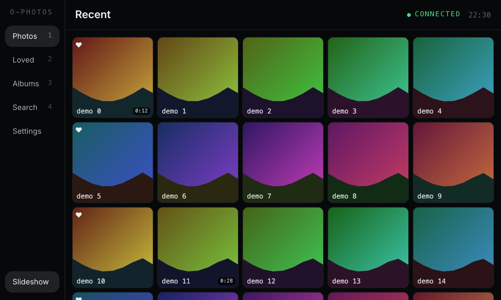

An Immich library as a photo frame. Set the server and API key in the companion app; requests go
through the phone. Browse Recent, Loved and Albums, filter by landscape or portrait, view details,
favourite, and run a slideshow with five transitions. Pictures are cached on the device, and a demo
library works without a key. Videos show their still only.

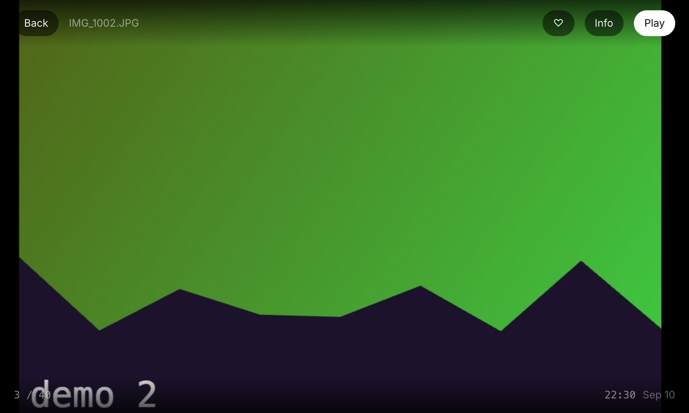

### Controls

| What you do | What happens |
| --- | --- |
| Preset button 1 | Recent |
| Preset button 2 | Loved |
| Preset button 3 | Albums |
| Preset button 4 | Turn the screen a quarter |
| Mode | Start or stop the slideshow |
| Turn the wheel | Scroll the grid, or move through the viewer |
| Space | Pause or resume the slideshow |
| I | What is known about the picture |
| Back | Out of the viewer, or into the settings |

## O-Pixel Art

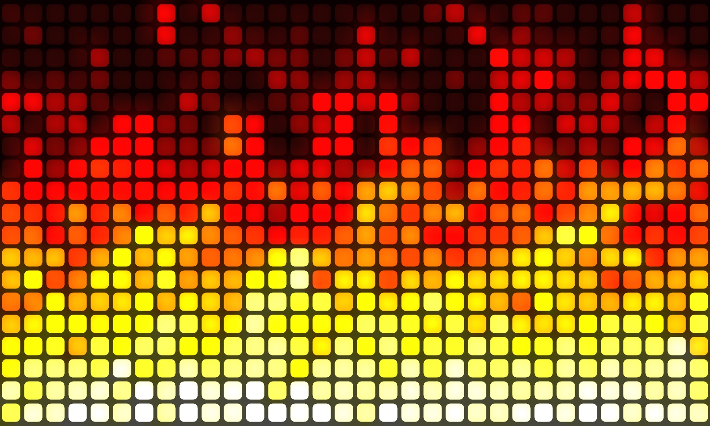

A 32x19 glowing LED wall at thirty frames a second, with seven scenes: Fire, Plasma, Digital rain,
Starfield, Rain, Life and Clock.

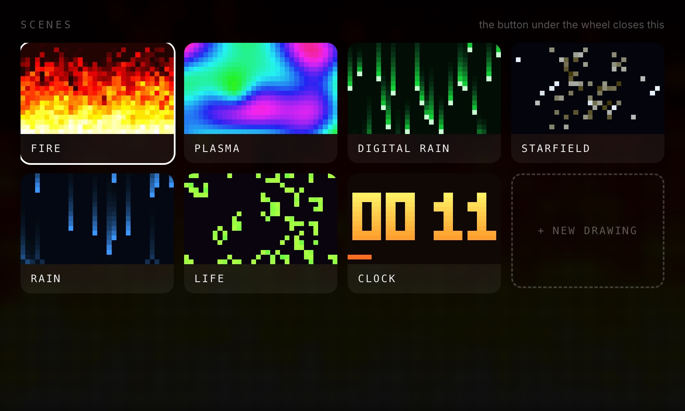

**Draw** (or preset 4) turns the wall into a canvas with a sixteen-colour palette. Your drawings join
the scenes and can be edited later. The companion app sets speed, glow and auto scene change. No
phone needed.

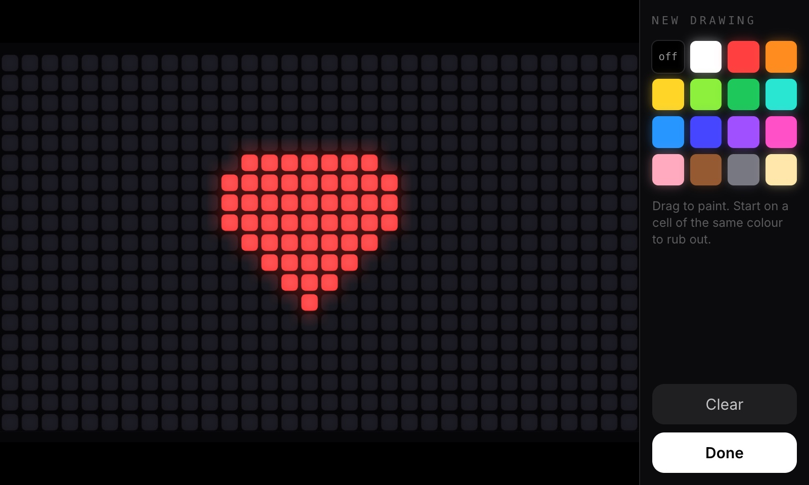

### Controls

| What you do | What happens |
| --- | --- |
| Turn the wheel, or swipe | Next or previous scene; while drawing, the next colour |
| Preset button 1 / 3 | Previous / next scene; while drawing, the colour before or after |
| Preset button 2 | Pause the scene; while drawing, the eraser |
| Preset button 4 | Draw, or edit the drawing on screen; while drawing, done |
| Mode, or the button under the wheel | All the scenes; while drawing, the button under the wheel is done |
| Touch | Show the scene's name and buttons |

## Working on it

```sh
bun run dev <slug>                           # run one app against a connected Car Thing
bun run --cwd apps/MusicPlayerV1 push        # build and install onto the device
bun run --cwd apps/MusicPlayerV1 typecheck   # types for src, settings and extension
bun run check                                # the whole gate: typecheck, build, bundle, catalog
bun run bump MusicPlayerV1 patch -m "note"   # move the version and open a changelog entry
```

| App | Dev server |
| --- | --- |
| O-Music Player | http://localhost:5173 |
| O-Clock | http://localhost:5174 |
| O-Desk Exchange | http://localhost:5175 |
| O-Gold Tracker | http://localhost:5176 |
| O-System Monitor | http://localhost:5177 |
| O-Quote Flow | http://localhost:5178 |
| O-Map | http://localhost:5179 |
| O-Photos | http://localhost:5180 |
| O-Pixel Art | http://localhost:5181 |

Pushing to main publishes the catalog. Published versions never change, so bump before shipping;
`check` refuses an unbumped change.

> `push` fails if the repository path contains spaces.
